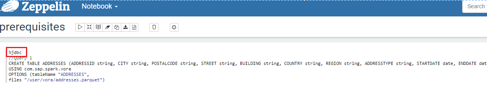

VINE
===============
Vora INteractive Education(VINE) is a demo content for SAP Vora

## Overview

VINE makes it easy to learn how to consume SAP Vora features. It acts as reference for application developers and showcases the features of VORA in an easy to understand business scenario. This demo content comes complete with  
- Sample data
- SQL statements
- Documentation
- Tutorials
- Apache Zeppelin Notebooks

## Prerequisites

1. SAP Vora Setup- Follow one of the below documentation and setup your SAP Vora environment
   - [SAP Data Hub Developer Edition](https://blogs.sap.com/2017/12/06/sap-data-hub-developer-edition/)  
       
    OR
    
    - [SAP Vora 2.0  Cluster](https://help.sap.com/http.svc/rc/f09ec811fe634f588647c342cac84c38/2.0/en-US/SAP_Vora_Installation_Admin_Guide_2.0_en.pdf)  
  
    
2. SAP Lumira
   - Have SAP Lumira Desktop Version 1.29 or higher. It can be downloaded from [SAP Support Portal](https://launchpad.support.sap.com/#/softwarecenter)
   
   - Go to SAP Support Portal and select By Alphabetical Index (A-Z) -> alphabet L -> SAP Lumira -> SAP Lumira 1.0 -> Compromised Software component versions -> SAP Lumira 1.0 64 bit -> SAPLUMIRA6429P_3-20009491.EXE(version 1.29.3 or higher)
   

3. Creating necessary tables and view
    - Download the Apache Zeppelin notebook from following link [prerequisites](./zeppelin_notebooks/prerequisites.json)

    - Upload the notebook to Apache Zeppelin - < hostname >:9099.
      for help follow the steps in the [link](https://zeppelin.apache.org/docs/0.6.0/quickstart/explorezeppelinui.html)

    - The notebook will open up. 
    
    - *If you are using SAP Vora 2.0 Cluster then change the interpreter to %vora from %vorathrift.( by default it has been set to %vorathrift   in all the Apache Zeppelin notebooks) as shown in image below*
    
    
    - Now you can click on Run all paragraphs button on top of the page to create tables in SAP Vora using data from the existing             HDFS files preloaded on the instance. 

    A dialog window will pop up asking you to confirm to Run all paragraphs? Click OK. 
      
      
## VINE Load Data

The steps to load VINE data to SAP Vora Developer Edition and SAP Vora Cluster is different. Please follow the respective section below based on your SAP Vora setup

### SAP Data Hub Developer Edition

   Follow the below steps once your container is up and running

   1. Download all the files from [here](../../archive/master.zip)
   
   2. Extract the downloaded content and open the command prompt.
   
   3. Navigate to the data folder and copy the files present in the data folder to your container using the following command:-
   
      `docker cp data <container name>:/tmp/data/`
      
      *to know your container name execute the following command, by default container name will be datahub*
      
      `docker ps`
      
   4. Start the bash shell of the container using the following command:-
   
      `docker exec -ti <container name> /bin/bash`
   
   5. Push the files present in the data folder to HDFS.
    
      `hdfs dfs –put /tmp/data/* /user/vora`
      
      *If the folder "user/vora" doesnt exist then , do create the folder structure using the following command*
      
      `hdfs dfs -mkdir /user`
      
      `hdfs dfs -mkdir /user/vora`
    	
   6. Check if the files are correctly loaded in to HDFS.
    
      `hdfs dfs -ls /user/vora`

### SAP Vora Cluster

   1. Log into any of the worker node via PuTTY
    
   2. Switch the user to the vora user created while setting up the Vora cluster.
    
      `sudo su –`

      `sudo –iu  <vora_user>`
        	
   3. Download all the files from [here](../../archive/master.zip)
    
   4. Push the files present in the data folder to HDFS.
    
      `hdfs dfs –put <filename> /user/<vora_user>`
    	
   5. Check if the files are correctly loaded in to HDFS.
    
      `hdfs dfs -ls /user/<vora_user>`
    

## Features Deep Dive:

 - [Basic SQL](./documentation/basic_sql/README.md)
 - [Hierachies](./documentation/hierarchies/README.md) 
 - [SAP Vora - SAP HANA Integration](./documentation/vora_hana_integration/README.md)
 - [SAP Lumira Visualization](./tutorials/lumira/README.md)
 - [Vora Modeler Tutorials](./tutorials)

## Support
For any question/clarification or report an issue in VINE please [create issue](https://github.com/SAP/vora-vine/issues/new)

## License
[Apache License 2.0](LICENSE)
