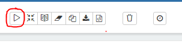
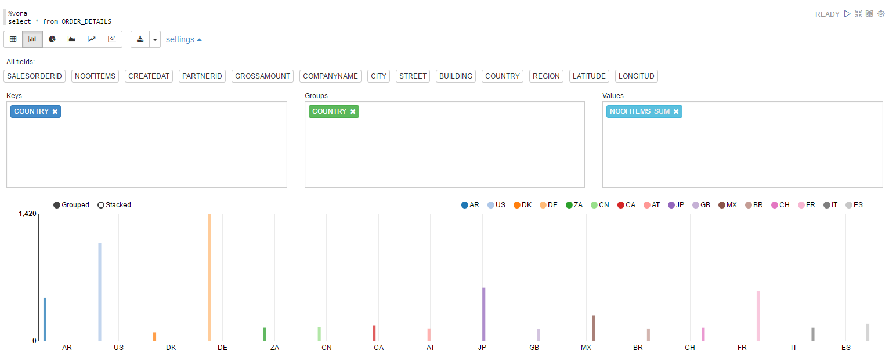
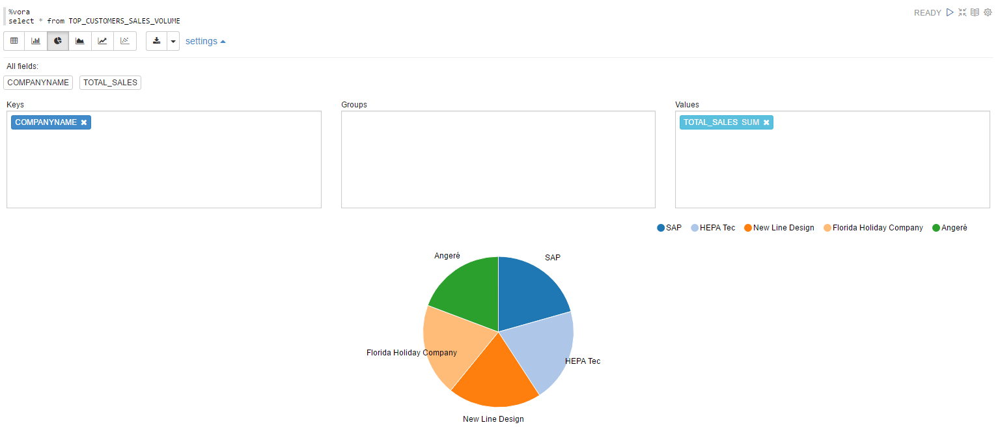

## Basic SQL

### Steps

- Download the Apache Zeppelin notebook from following link [basic_sql](./../../zeppelin_notebooks/basic_sql.json)

- Upload the notebook to Apache Zeppelin - < jumpbox >:9099 in case of vora cluster and < ip address >:9099 in case of dev edition. 
      For help on how to upload Apache Zeppelin notebooks follow the steps in the [link](https://zeppelin.apache.org/docs/0.6.0/quickstart/explorezeppelinui.html)
- The notebook will open up. Now you can click on Run all paragraphs button on top of the page to create tables in SAP Vora using       data from the existing HDFS files preloaded on the instance. 

  A dialog window will pop up asking you to confirm to Run all paragraphs? Click OK. 
      

### Queries

Query 1
- Visualise the Average order size for each Country in a Bar chart.

    ```sql
    SELECT * FROM ORDER_DETAILS
    ```

 

Query 2
- Create view, TOP_CUSTOMERS_SALES_VOLUME to get the top 5 companies with maximum purchases made.

    ```sql
      CREATE VIEW TOP_CUSTOMERS_SALES_VOLUME AS
      SELECT COMPANYNAME , SUM(GROSSAMOUNT) AS TOTAL_SALES 
      FROM  BUSINESS_PARTNER 
            INNER JOIN SO_HEADER 
            ON  BUSINESS_PARTNER.PARTNERID = SO_HEADER.PARTNERID
      GROUP BY COMPANYNAME 
      ORDER BY TOTAL_SALES DESC
      LIMIT 5
      USING com.sap.spark.view
    ```
    

Query 3
- Visualise the top 5 companies and their total purchases, in terms of amount, in a pie chart. 

    ```sql
      SELECT * FROM TOP_CUSTOMERS_SALES_VOLUME
     ```
  

```
Alernate Option : The Queries mentioned above can be run from SAP Vora SQL Editor ([jumpbox]:9443/web/#/sql-editor).
```
