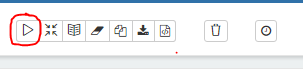
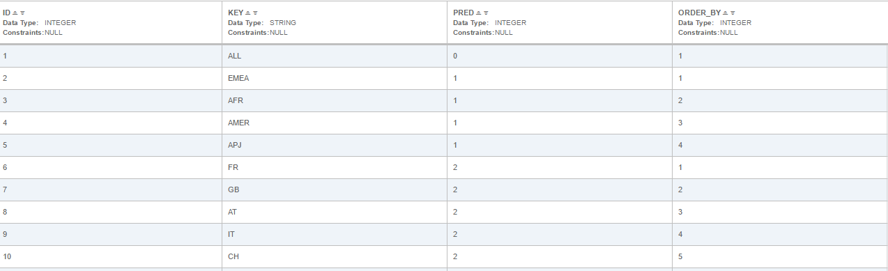
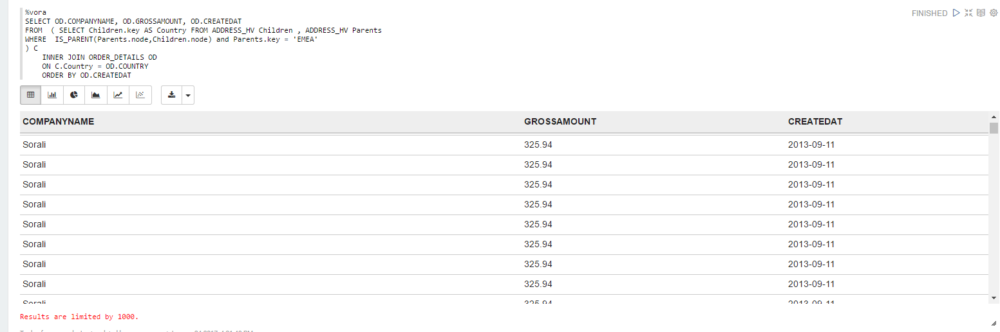
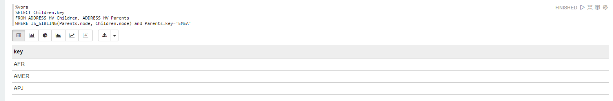

## Hierarchies

### Steps

- Download the Apache Zeppelin notebook from following link [hierarchies](./../../zeppelin_notebooks/hierarchies.json)

- Upload the notebook to Apache Zeppelin - < jumpbox >:9099 in case of vora cluster and < ip address >:9099 in case of dev edition. 
    For help on how to upload Apache Zeppelin notebooks follow the steps in the [link](https://zeppelin.apache.org/docs/0.6.0/quickstart/explorezeppelinui.html)
- The notebook will open up. Now you can click on Run all paragraphs button on top of the page to create tables in SAP Vora using       data from the existing HDFS files preloaded on the instance. 

  A dialog window will pop up asking you to confirm to Run all paragraphs? Click OK. 
      

### Queries

Query 1
- Create table ADDRESS_HIER_INPUT which has the Id and Key of each node and the Id of its parent. Each row also has an Order_By column which specifies how to order the children of the same parent. For example, country France has Id 6 with Key as FR. Id of its parent is 2, which in turn points to the row with Key as EMEA. The Order_By column has the value 1, which signifies that among all the children of EMEA, FR will be in the position 1.  
    ```sql
    CREATE TABLE ADDRESS_HIER_INPUT (id int, key string, pred int, order_by int)
    USING com.sap.spark.vora
    OPTIONS (tableName "ADDRESS_HIER_INPUT",
    files "/user/vora/address_hierarchy.csv")  
    ```
    
 


Query 2
- Create hierarchy view ADDRESS_HV from the table ADDRESS_H. Relations are formed as per the data in ADDRESS_H.
   ```sql
    CREATE VIEW ADDRESS_HIER_VIEW as select key, node from hierarchy (
    USING ADDRESS_HIER_INPUT AS child
    JOIN PRIOR par ON child.pred = par.id
    ORDER SIBLINGS BY order_by ASC
    START WHERE pred = 0
    SET node
    ) AS H     
    ```

Query 3
- Here, the data is filtered so that only those sales made in direct descendants of Europe (all countries having 'EMEA' as parent in ADDRESS_HIER_INPUT) are displayed.

   ```sql
    SELECT OD.COMPANYNAME, OD.GROSSAMOUNT, OD.CREATEDAT
    FROM  ( SELECT Children.key AS Country FROM ADDRESS_HIER_VIEW Children , ADDRESS_HIER_VIEW Parents 
    WHERE  IS_PARENT(Parents.node,Children.node) and Parents.key = 'EMEA'
    ) C
    INNER JOIN ORDER_DETAILS OD
   	ON C.Country = OD.COUNTRY
  	ORDER BY OD.CREATEDAT    	
    ```
    


Query 4
- Next, we try to display those in the ADDRESS_HV which are in the same level as 'EMEA' if the data is is represented in a tree format.

   ```sql
    SELECT Children.key
    FROM ADDRESS_HIER_VIEW Children, ADDRESS_HIER_VIEW Parents
    WHERE IS_SIBLING(Parents.node, Children.node) and Parents.key='EMEA'   
    ```

