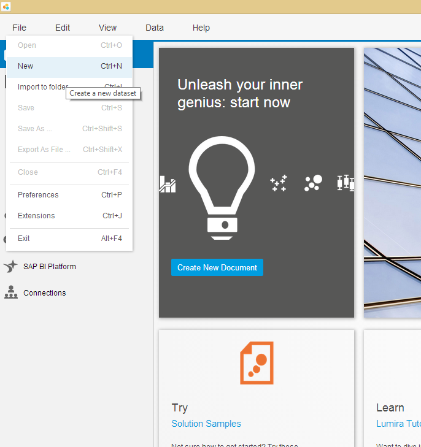
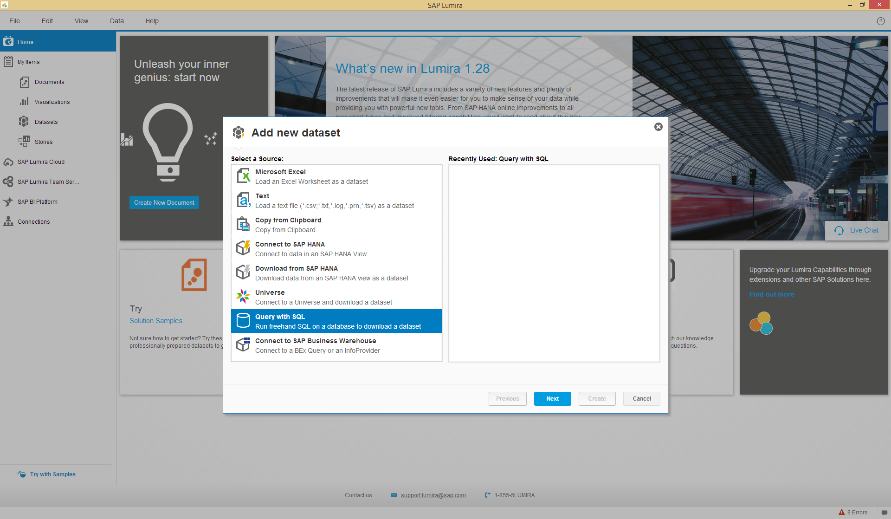
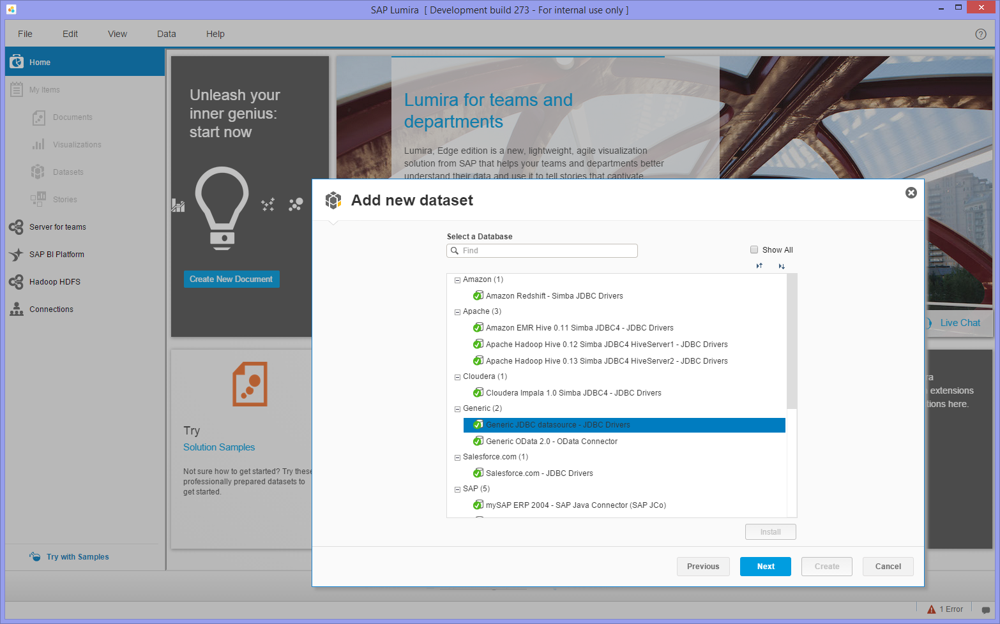
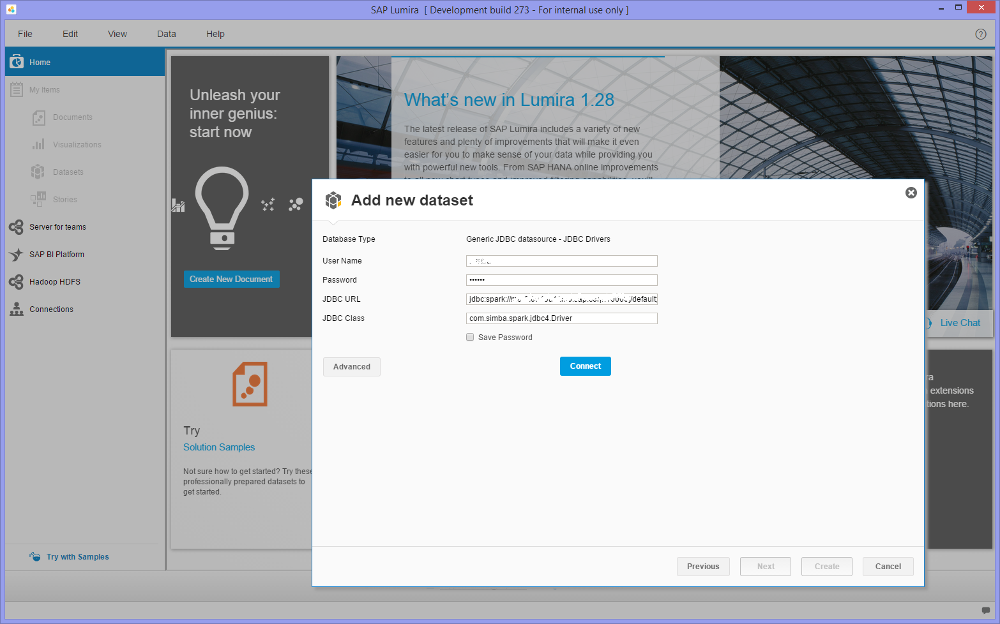
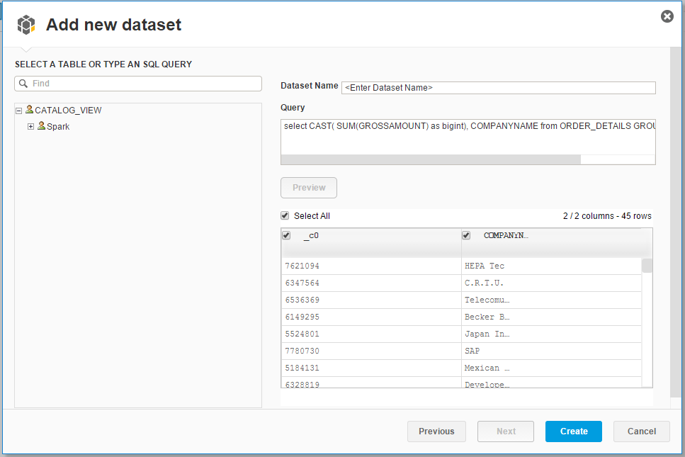
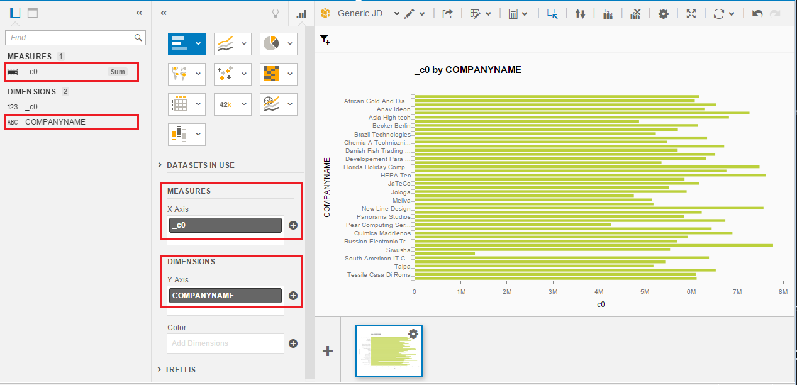

SAP Lumira Visualization
===============
> Please note that this scenario does not work in SAP Vora Developer edition due to connectivity restrictions. But it can be executed in a SAP Vora Cluster
##  Pre requistes
1. Login to SAP Vora Manager `<hostname of master>:19000` and check if Thrift Sever is running 

2.  Register tables in Thrift Sever. To do this Open Vora Tools and navigate to SQL Editor 

    Run  command     
     `REGISTER ALL TABLES USING com.sap.spark.vora OPTIONS(eagerload "false") IGNORING CONFLICTS;`
    
    Run below to check if all tables are registered
    `SHOW TABLES;`
  
## Connection setup in SAP Lumira
1.  Install JDBC driver
We will need to use the Apache Spark drivers as Generic JDBC driver. In SAP Lumira
    - Go to File -> Preferences -> SQL Drivers -> Generic -> Generic JDBC datasource, click on "Install Drivers" at the upper right
    - Select all *.jar files under <SAP Lumira Installation Folder>\Desktop\utilities\SparkJDBC
    - Restart SAP Lumira

## Visualizing in SAP Lumira
1. Open up SAP Lumira Desktop on your machine, and select File -> New.

2. Select "Query with SQL", and click Next.

3. Choose the Generic JDBC Data source (green mark indicates drivers are installed)

4. Enter the credentials and connection URLs as below and press connect:
    - Enter Username and password
    - JDBC URL: jdbc:spark://[host]:[port]/default;CatalogSchemaSwitch=0;UseNativeQuery=1 (default port: 19123)
    - JDBC Class: com.simba.spark.jdbc4.Driver

5. In the Query box type the query
`select CAST( SUM(GROSSAMOUNT) as bigint), COMPANYNAME from ORDER_DETAILS GROUP BY COMPANYNAME`
6. Press Preview button to preview results of query

7. Click on Create Button
8.  Drag the Sum column to X Axis and Company Name to Y Axis in Visualization Tab of Lumira as shown in snapshot

 
