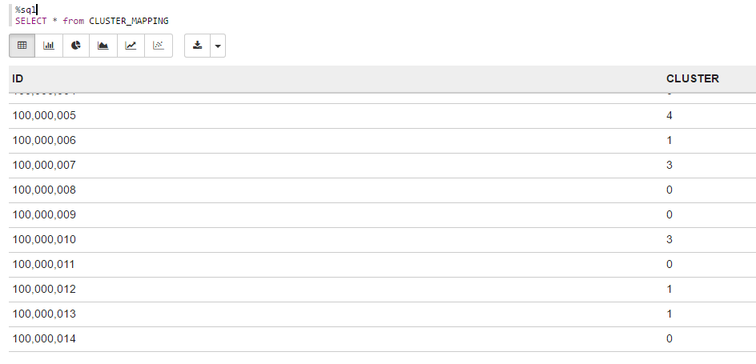
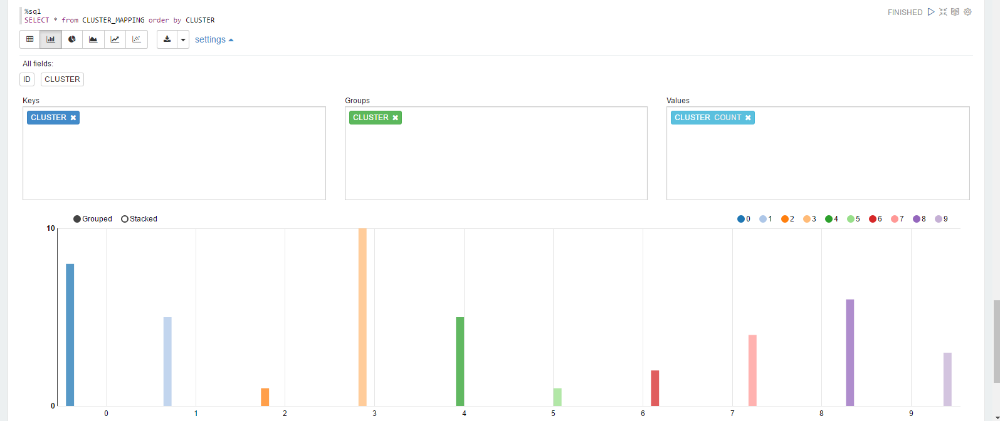
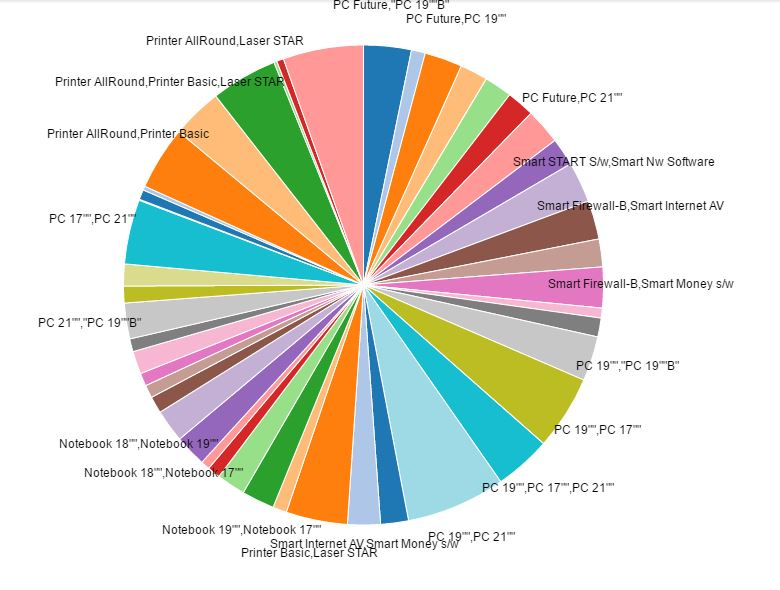
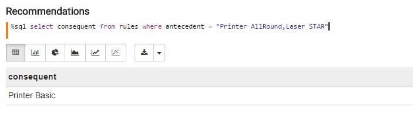

## Machine Learning

### Steps

- Download the Apache Zeppelin notebook from following link [machine_learning](./../../zeppelin_notebooks/machine_learning.json)

- Upload the notebook to Apache Zeppelin - < jumpbox >:9099 in case of vora cluster and < ip address >:9099 in case of dev edition. 
     For help on how to upload Apache Zeppelin notebooks follow the steps in the [link](https://zeppelin.apache.org/docs/0.6.0/quickstart/explorezeppelinui.html)
- The notebook will open up. Now you can click on Run all paragraphs button on top of the page to create tables in SAP Vora using       data from the existing HDFS files preloaded on the instance. 

   A dialog window will pop up asking you to confirm to Run all paragraphs? Click OK. 
      

    
### K-means

#### Scenario  : Clusterting the Business Partners to form a community of similar Customers.

K-means is one of the most commonly used clustering algorithms that clusters the data points into a predefined number of clusters. The input data is a table containing the numeric values of attributes for each entity (Business Partner here) to be clustered.

Query 1
- Create view KMEANS_INPUT_REFERENCE_DATA which has the columns PartnerId, Total Sales, Total No. of Items and Region. Here, Total Sales, Total No. of Items and Region serves as the attributes which will cluster the Business Partners to different clusters. 

    ```sql
    CREATE VIEW KMEANS_INPUT_REFERENCE_DATA AS
    SELECT PARTNERID, SUM(GROSSAMOUNT) as TOTAL_SALESAMOUNT, 
    SUM(NOOFITEMS) as NOOFITEMS, CASE REGION WHEN 'APJ' THEN 1 WHEN 'AFR' THEN 2 WHEN 'AMER' THEN 3 WHEN 'EMEA' THEN 4 END as REGION
    FROM ORDER_DETAILS
    GROUP BY PARTNERID, REGION 
    ORDER BY PARTNERID
    USING com.sap.spark.view
    ```

Query 2
- The data in view KMEANS_INPUT_REFERENCE_DATA, in csv format, serves as the input to KMeans algorithm to cluster the Business Partners.
      
     ```sql
     SELECT * FROM  KMEANS_INPUT_REFERENCE_DATA
     ```

Program 1
- Program uses the Kmeans algorithm from the Spark Mllib library to cluster the Business Partners. 

     ```scala
      // Program 1
      import org.apache.spark.mllib.linalg.Vectors
      import org.apache.spark.mllib.clustering.KMeans
      import org.apache.spark.sql.functions._

      //Load input data
      val data = sc.textFile("/user/vora/kmeans_input_data.csv")

      //Removing the headers
      val header = data.first
      val rows = data.filter(l => l != header)

      //Defining the case class
      case class caseClass(ID: String, TOTAL_SALESAMOUNT: Double, NOOFITEMS: Double, REGION: Int)

      //Split each row by comma to get the columns
      val rowSplit = rows.map(line => line.split(","))

      //Mapping the data to case class
      val rowData = rowSplit.map( p => caseClass( p(0).toString, p(1).trim.toDouble, p(2).trim.toDouble, p(3).trim.toInt))

      //Creating dataframe from the rowData
      val df1 = rowData.toDF()

      //Convert to RDD with the rowId
      val rdd1 = df1.rdd.map(r => (r.getString(0),  r.getDouble(1), r.getDouble(2), r.getInt(3)))

      //Cache the RDD
      rdd1.cache()

      //Convert to RDD without rowId. This will be the input to the KMeans algorithm
      val vectors = df1.rdd.map(r => Vectors.dense( r.getDouble(1), r.getDouble(2), r.getInt(3)))
      //Cache the RDD
      vectors.cache()

      //KMeans model with 10 clusters and 30 iterations
      val numClusters = 10
      val numIterations = 30
      val kMeansModel = KMeans.train(vectors, numClusters, numIterations)

      //Print the center of each cluster
      kMeansModel.clusterCenters.foreach(println)

      //Get the clusters from the model and link it to the rowId using rdd1
      val cluster = rdd1.map{r => (r._1, kMeansModel.predict(Vectors.dense(r._2, r._3, r._4) ))}

      //Convert rdd to dataframe with rowId and cluster
      val clusterDF = cluster.toDF("ID", "CLUSTER")

      //Create temporary table from the df and display the results 
      clusterDF.registerTempTable("CLUSTER_MAPPING")
      clusterDF.show()

     ```


Query 3
- Here, the chart shows how many Business Partners are mapped to each cluster.
      
   ```sql
    SELECT * FROM CLUSTER_MAPPING
   ```



    


### FP-Growth 

#### Scenario  : Mining frequent items 

FP-Growth (Frequent Pattern Growth) is a scalable technique for mining frequent pattern in a database with two scans of the database. It is much faster than the other popular methods for mining frequent patterns, e.g. the Apriori Algorithm and the TreeProjection.
      
Program 2 
- Program uses the FP-Growth algorithm to identify the items bought together and their frequencies.

     ```scala
      // Program 2
      import org.apache.spark.sql.SQLContext
      import org.apache.spark.rdd.RDD
      import org.apache.spark.mllib.fpm.FPGrowth
      import org.apache.spark.sql.hive.HiveContext
      import org.apache.spark.sql.SQLContext
      import org.apache.spark.sql.functions.collect_list
      import org.apache.spark.sql.Row

      //Loading data
      var soItem = sqlContext.read.load("/user/vora/soItemData.parquet")
      val texts = sqlContext.read.load("/user/vora/texts.parquet")
      val products  = sqlContext.read.load("/user/vora/products.parquet")

      // Grouping product based on salesOrder
      soItem.registerTempTable("SO_ITEM");
      var soItemView = sqlContext.sql("SELECT SALESORDERID, PRODUCTID from SO_ITEM")
      soItemView.registerTempTable("SO_ITEM_VIEW");
      var groupedData = sqlContext.sql("SELECT SALESORDERID, collect_set(PRODUCTID) as itemList from SO_ITEM_VIEW group by SALESORDERID")
      groupedData.registerTempTable("GRP_BY_SOID")
      var itemsPerTransaction = sqlContext.sql("SELECT itemList from GRP_BY_SOID")

      // Converting List[String] to String
      val mkString = udf((items:Seq[String])=>items.mkString(","))
      val dataframeWithString = itemsPerTransaction.select($"itemList").withColumn("arrayString",mkString($"itemList"))
      var dfwsNew = dataframeWithString.drop(dataframeWithString.col("itemList"))
      var fpgInputData =  dfwsNew.rdd.map{x:Row => x.getAs[String](0)}

      // Running FPGrowth Algorithm
      val data: RDD[Array[String]] = fpgInputData.map(s => s.trim.split(','))
      val fpGrowth = new FPGrowth().setMinSupport(0.005).setNumPartitions(10)
      val fpGrowthModel = fpGrowth.run(data)

      var freqItemset = (fpGrowthModel.freqItemsets.map{itemset => (itemset.items,  itemset.freq)})
      var freqItemsetDF = freqItemset.toDF("frequentItems","frequency")
      val freqItemCollection = freqItemsetDF.filter(size('frequentItems) > 1)


      // replacing ProductID with product description
      val freqItems = freqItemsetDF.filter(size('frequentItems) === 1).select('frequentItems(0).as('item), 'frequency)
      texts.registerTempTable("TEXT")
      products.registerTempTable("PRODUCTS")
      val productDict = sqlContext.sql("SELECT PRODUCTID, SHORT_TEXT from PRODUCTS join TEXT where NAMEID == TEXTID")
      val freqDict = freqItems.join(productDict, 'item === 'PRODUCTID, "left").select('item, 'SHORT_TEXT).as[(String, String)].collect().toMap

      val pidToDescMapping = udf { items: Seq[String] => items.map(item => freqDict(item)) }
      val freqItemDescs = freqItemCollection.select('frequency, pidToDescMapping('frequentItems).as('itemDescs))
      val freqItemDescsString = freqItemDescs.select($"frequency",$"itemDescs").withColumn("ItemSet",mkString($"itemDescs"))
      val frequentItemDesc = freqItemDescsString.select($"ItemSet",$"frequency")

      // Normalising the frequency
      val min = frequentItemDesc.groupBy().min().head().getLong(0)
      val max = frequentItemDesc.groupBy().max().head().getLong(0)
      val minInDouble = min.toDouble
      val maxInDouble = max.toDouble
      val normaliseUDF: (Long => Double) = (arg: Long) => {(arg - minInDouble)/(maxInDouble - minInDouble)}
      val normalisedFreq = udf(normaliseUDF)
      val frequentItems = frequentItemDesc.withColumn("normalised_frequency", round(normalisedFreq(col("frequency")),2))
      frequentItems.registerTempTable("FREQUENT_ITEMS")

      // Generating rules for frequent Items
      val minConfidence = 0.8

      var rules = (fpGrowthModel.generateAssociationRules(minConfidence).map{ rule => (rule.antecedent.map(item => freqDict(item)).mkString(","), rule.consequent.map(item => freqDict(item)).mkString(","))})
      var rulesDF = rules.toDF("antecedent","consequent")
      rulesDF.registerTempTable("RULES")
     ```
     
Query 4
- Here, the frequent item sets and their frequencies are visualised in a pie chart
      
    ```sql
    SELECT * FROM FREQUENT_ITEMS
    ```

.
      




Query 5
- Association Rules [ Given the frequent itemsets, we are generating association rules that help us determine which item(s) 
tend to come together with some frequent itemset]
         These rules are stored in rules table and query is executed on the table.
    ```sql
    SELECT * FROM RULES
    ```
         


Query 6
- Recommendation [Based on rule table , we can make recommendations for any products bought in combination ]
           For example : If we have rules  
           A, B -> C and  A, B -> E
If someone buy products A, B then there is a probability of buying C and E too.
    
    ```sql
    SELECT consequent FROM RULES WHERE antecedent = "Printer AllRound,Laser STAR"
    ```
.
     
