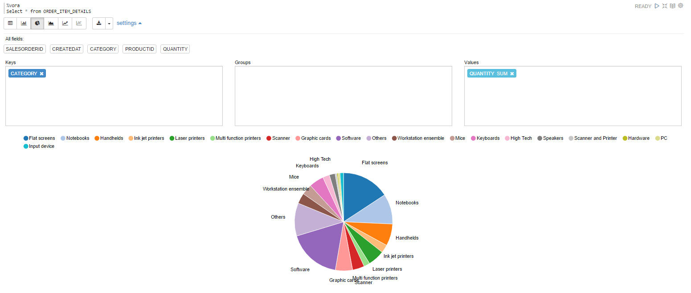

## SAP Vora - SAP HANA Integration

### Prerequisites
For the SAP Vora - SAP HANA Integration scenario, we will use SHINE (SAP HANA Interactive Education) which is a demo content for native SAP HANA application development. SHINE will be used for providing SAP HANA Tables with Master Data.
### SAP Vora Developer Edition
While working with SAP Vora Developer Edition, you will need to install SAP HANA Express Edition in the same system
as the SAP Vora Developer Edition. 
1. Follow the document [How to setup SAP HANA, express edition and SAP Vora, developer edition to enable them to connect to each other](https://www.sap.com/developer/how-tos/2017/04/sda-hana-vora.html)
2. Download and install SHINE(SAP HANA Interactive Education) for XSC in your SAP HANA system. SHINE for XSC can be downloaded from [github](https://github.com/SAP/hana-shine/blob/master/HCO_DEMOCONTENT_200.tgz?raw=true) . Please note that a file with name HCO_DEMOCONTENT_200.tgz will get downloaded
3. Follow the steps in Chapter 2.2 of [SHINE installation guide](https://help.sap.com/doc/bf0ee2761d9240b984425545869eac80/2.0.01/en-US/SAP_HANA_Interactive_Education_SHINE_en_HANA2.0SPS01.pdf) to install SHINE for XSC
4. Note down the SAP HANA Systems host name, instance number, HANA User Name and HANA User Password

### SAP Vora Cluster
With a SAP Vora Cluster one can choose SAP HANA Express Edition or SAP HANA Platform Edition
1. Setup a [SAP HANA Express Edition](https://www.sap.com/developer/topics/sap-hana-express.html) or get access to q SAP HANA Platform Edition system
2. Download and install SHINE(SAP HANA Interactive Education) for XSC in your HANA system. SHINE for XSC can be downloaded from [github](https://github.com/SAP/hana-shine/blob/master/HCO_DEMOCONTENT_200.tgz?raw=true) . Please note that a file with name HCO_DEMOCONTENT_200.tgz will get downloaded
3. Follow the steps in Chapter 2.2 of [SHINE installation guide](https://help.sap.com/doc/bf0ee2761d9240b984425545869eac80/2.0.01/en-US/SAP_HANA_Interactive_Education_SHINE_en_HANA2.0SPS01.pdf) to install SHINE for XSC
4. Note down the SAP HANA System host name, instance Nnmber, HANA User Name and HANA User Password


### Steps

- Download the Apache Zeppelin notebook from following link [SAP VORA - SAP HANA Integration](./../../zeppelin_notebooks/vora_hana_integration.json)

- Upload the notebook to Apache Zeppelin - < jumpbox >:9099 in case of vora cluster and < ip address >:9099 in case of dev edition. 
      For help on how to upload Apache Zeppelin notebooks follow the steps in the [link](https://zeppelin.apache.org/docs/0.6.0/quickstart/explorezeppelinui.html)

- The notebook will open up. Modify the QUERY 1 by entering the details of host, instance number, username and password of your hana system

- Now you can click on Run all paragraphs button on top of the page to create tables in SAP Vora using       data from the existing     HDFS files preloaded on the instance. 

     A dialog window will pop up asking you to confirm to Run all paragraphs? Click OK. 
     


### Queries
Query 1
- Create virtual table PRODUCTS in Vora from the HANA table sap.hana.democontent.epm.data::MD.Products under the Schema "SAP_HANA_DEMO".Other SAP HANA connectivuty details like , host, instance number, HANA User Name and HANA User Password also must be provided to facilitate the connection.
     
   ```sql
    CREATE TABLE SHINE_PRODUCTS
    USING com.sap.spark.hana
    OPTIONS (
    path "sap.hana.democontent.epm.data::MD.Products",
    dbschema "SAP_HANA_DEMO",
    host "<host name>",
    instance "<instance number>",
    user "<HANA User Name>",
    passwd "<HANA User Password>"
    )
      
   ```

Query 2
- Create view ORDER_ITEM_DETAILS that has all the details of the every product sold in an order.
      
   ```sql
    CREATE VIEW ORDER_ITEM_DETAILS AS
    SELECT SO_HEADER.SALESORDERID , CREATEDAT , CATEGORY , SO_ITEM.PRODUCTID , QUANTITY  
    FROM  SO_HEADER
  	INNER JOIN SO_ITEM 
    ON SO_HEADER.SALESORDERID = SO_ITEM.SALESORDERID 
  	INNER JOIN SHINE_PRODUCTS 
  	ON SO_ITEM.PRODUCTID = SHINE_PRODUCTS.PRODUCTID
   	ORDER BY SALESORDERID
   USING com.sap.spark.view
      
   ```

Query 3
- Visualise how many products are sold in each category.
      
   ```sql
    SELECT * FROM ORDER_ITEM_DETAILS 
   ```

 
