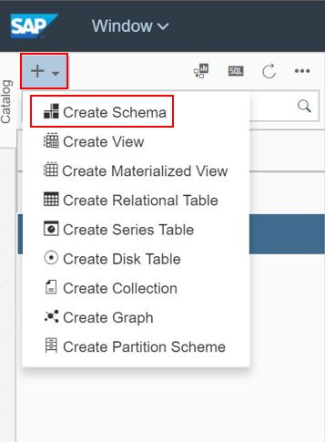
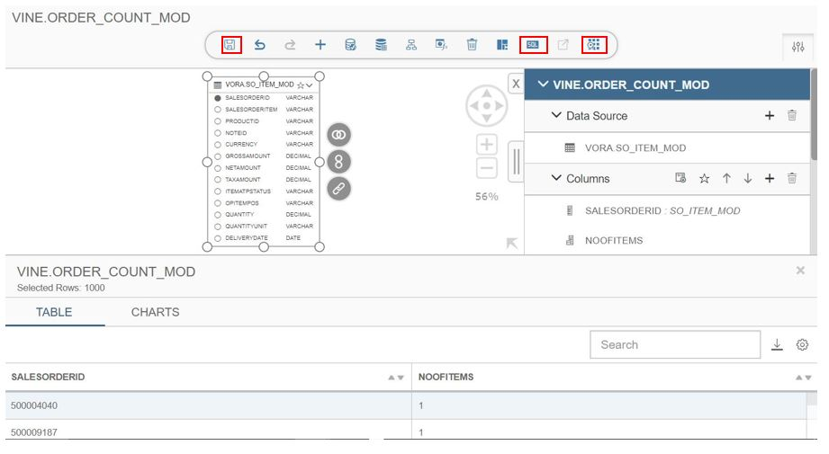
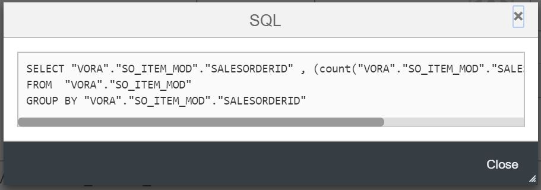
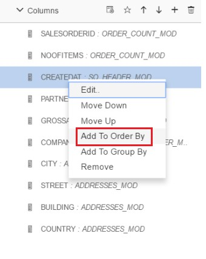
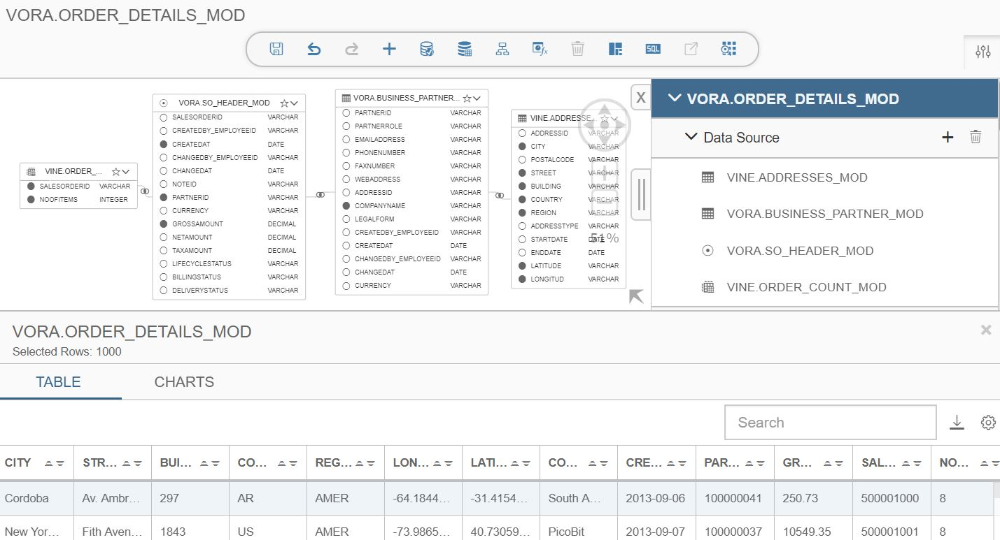
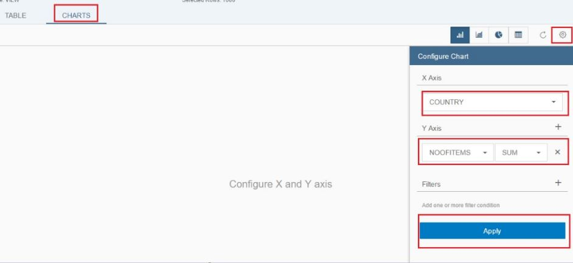
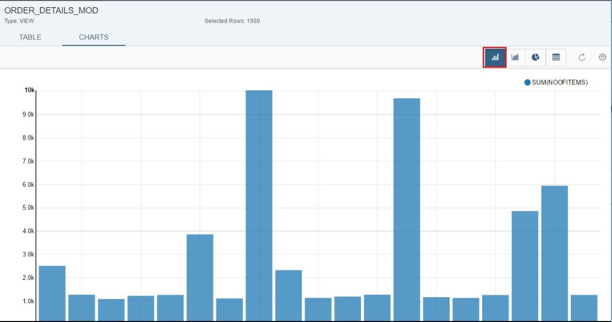

## Tables and Views in Vora

### Creating Vora relational table

1. For creating table in modeler go to the modeler tab. 
2. Click on + in the navigation pane. 
3. Select the type of the table to create. As here we are creating Relational Vora table, select “Create Relational table”.

   
   
4. Name the table as “ADDRESSES_MOD”. Give the file type (here we are using addresses.parquet file for creating this table). Choose file path (/user/vora/addresses.parquet) in HDFS.

   
   
5. Once you click on next,  it will ask you column details. Click on + in menu bar and add columns and their data types. Once done click on Finish.

   
   
6. You can see the table schema i.e columns and their data types on the right-hand side.

   
   
7. Create the BUISINESS_PARTNER_MOD table using the steps 1.2 to 1.6 or create it directly by running the below query in SQL editor.

   ```sql
   CREATE TABLE BUSINESS_PARTNER_MOD (PARTNERID string, PARTNERROLE string, EMAILADDRESS string, PHONENUMBER string, FAXNUMBER string, WEBADDRESS string, ADDRESSID string, COMPANYNAME string, LEGALFORM string, CREATEDBY_EMPLOYEEID string, CREATEDAT date, CHANGEDBY_EMPLOYEEID string, CHANGEDAT date, CURRENCY string) USING com.sap.spark.engines.relational OPTIONS (tableName "BUSINESS_PARTNER", files "/user/vora/businessPartner.orc", format "orc");

   ```

   
   
8. Similarly Create the SO_HEADER_MOD table directly by running the below query in SQL editor.

   ```sql
   CREATE TABLE SO_HEADER_MOD (SALESORDERID string, CREATEDBY_EMPLOYEEID string, CREATEDAT date, CHANGEDBY_EMPLOYEEID string, CHANGEDAT date, NOTEID string, PARTNERID string, CURRENCY string, GROSSAMOUNT decimal(15,2), NETAMOUNT decimal(15,2), TAXAMOUNT decimal(15,2), LIFECYCLESTATUS string, BILLINGSTATUS string, DELIVERYSTATUS string) USING com.sap.spark.engines.relational OPTIONS (tableName "SO_HEADER", files "/user/vora/soHeaderData.csv");
   
   ```

   
   
9. Create SO_ITEM_MOD table directly by running the below query in SQL editor.

   ```sql
   CREATE TABLE SO_ITEM_MOD (SALESORDERID string, SALESORDERITEM string, PRODUCTID string, NOTEID string,  CURRENCY string, GROSSAMOUNT decimal(15,2), NETAMOUNT decimal(15,2), TAXAMOUNT decimal(15,2), ITEMATPSTATUS string, OPITEMPOS string, QUANTITY decimal(15,2), QUANTITYUNIT string, DELIVERYDATE date ) USING com.sap.spark.engines.relational OPTIONS (tableName "SO_ITEM", files "/user/vora/soItemData.csv");
   
   ```

   

### Creating Views in Vora modeler 1.4

1. For creating view, again go to the modeler, Click on + in the navigation pane. Select “Create View” option.

   
   
2. Name it as ORDER_COUNT_MOD. The view type will remain SQL. Click Ok.

   
   
3. Now in the ORDER_COUNT_MOD view , add SO_ITEM_MOD as data source and place it in the canvas.

   
   
4. Select SALESORDERID by selecting the small circle next to the column name. Once the column is selected, circle become black. As well as column name are added to columns part of the view in the right pane.
5. For adding the calculated column,  click on + in the columns part of view.

   
   
6. Once you click on + icon, it will open Add calculated column dialog box. Give name as NOOFITEMS. Add count(SO_ITEM_MOD.SALESORDERITEM) in expression field. Click Ok.

   
   
7. Add group by clause in our view by right clicking on group by part of the view, select “Add all non-aggregate columns”. It will add SALESORDERID to the group by clause.

   
   
8. Once SALESORDERID has been added to the view, save the view. You can see the records in the view by clicking on preview button.

   
   
9. Click on SQL icon in the modeler editor to see the generated sql.

   
   
10. To create the ORDER_DETAILS_MOD view, go back to Modeler. Create a new sql view, name it as order_details. Add order_count, so_header, business_partner and addresses as a data source.

    
    
11. Create the join between ORDER_COUNT_MOD and SO_HEADER_MOD table, click and highlight the order_count table and click on the join symbol.

    
    
12. Drag and drop it to the SO_HEADER_MOD header table.

    
    
13. The Join window will pop up. Click on the proposed condition. Based on the common column between these two table, it will suggest a condition. Accept it. Click Ok. 
14. Similarly, join SO_HEADER_MOD and BUSINESS_PARTNER_MOD using the condition SO_HEADER_MOD.PARTNERID = BUSINESS_PARTNER_MOD.PARTNERID and join BUSINESS_PARTNER_MOD and addresses using the condition BUSINESS_PARTNER_MOD.ADDRESSID = ADDRESSES_MOD.ADDRESSID. 
15. Select columns to project from all the tables.

    
    
16. In the right pane right-click on CREATEDAT column and add it to order by.

    
    
17. Save the view. You can preview it by clicking on preview tab. Click on SQL icon to see the generated Sql.

    
    
18. Generated SQL should look like below SQL.

    

### Visualizing the View

1. Click on Data Browser -> Click “CHARTS” -> Click on Settings and make the changes as shown below and select APPLY.

   
   
2. Visualization of data by selecting different charts like histogram ,pie chart etc.

   
   
   
