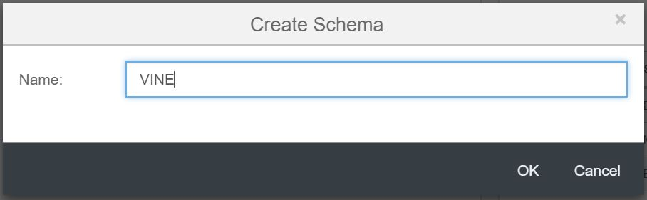
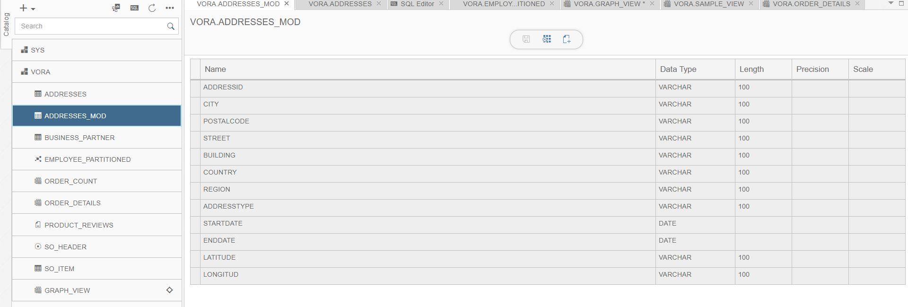
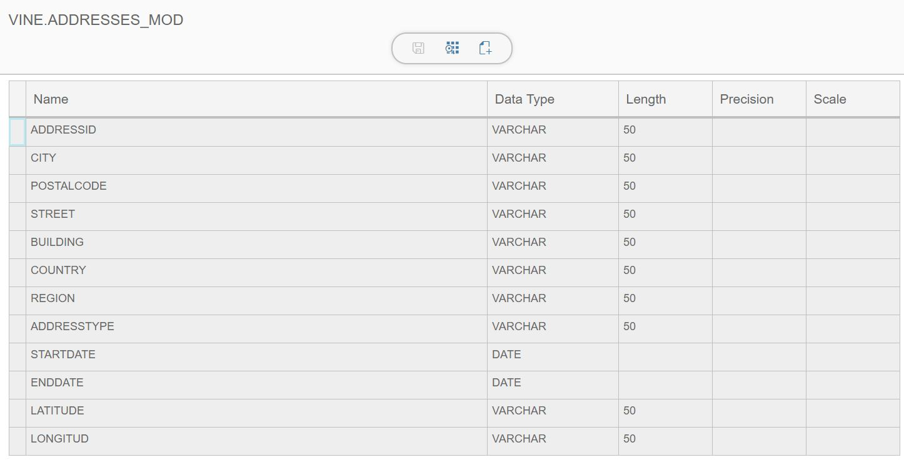
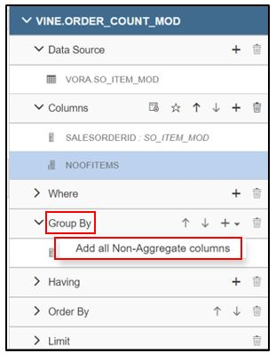
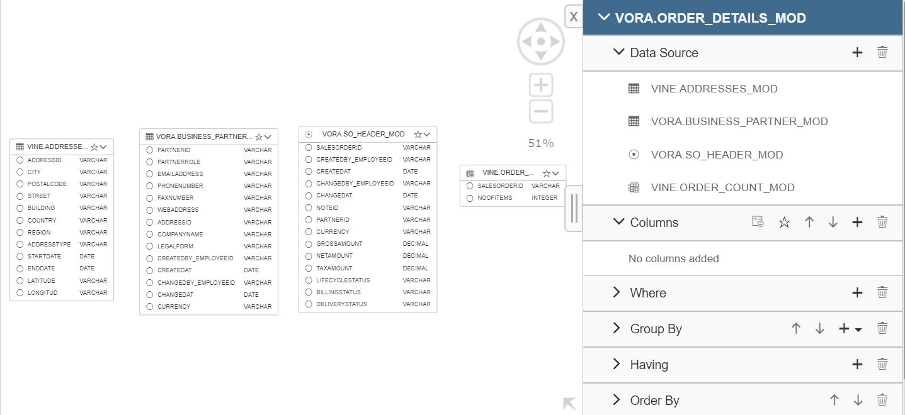

## Tables and Views in Vora

### Creating Schemas

Schema in VORA allows one to logical grouping the database objects such as tables and views. For creating schema in modeler tool  follow the below steps. 

1. Open the vora tools and click on + in the navigation pane. 
2. Select "Create Schema" menu option.
   
   
   
3. provide name for the schema for e.g: "VINE"

   
   
4. choose "OK"

   
 
### Creating Vora relational table

1. Click on + in the navigation pane. 
2. Select the type of the table to create. As here we are creating Relational Vora table, select “Create Relational table”.

   
   
3. Name the table as “ADDRESSES_MOD”. 
4. Choose the schema under which you want to create table. here we have selected "VINE" schema.
5. Provide namenode address as "hdfs:9000". Give the file type (here we are using addresses.parquet file for creating this table). Choose file path (/user/vora/addresses.parquet) in HDFS.

   
   
6. Once you click on next. It will show colums and their datatypes.Edit the columns and their data types, if required. Once done click on Finish.   
7. You can see the table schema i.e columns and their data types on the right-hand side.

   
   
8. Create the BUISINESS_PARTNER_MOD table using the step 1 to 6 or create it directly by running the below queries in SQL editor.

   ```sql
   CREATE TABLE BUSINESS_PARTNER_MOD (PARTNERID VARCHAR(50), PARTNERROLE  VARCHAR(50), EMAILADDRESS  VARCHAR(50), PHONENUMBER  VARCHAR(50), FAXNUMBER  VARCHAR(50), WEBADDRESS  VARCHAR(50), ADDRESSID  VARCHAR(50), COMPANYNAME  VARCHAR(50), LEGALFORM  VARCHAR(50), CREATEDBY_EMPLOYEEID  VARCHAR(50), CREATEDAT date, CHANGEDBY_EMPLOYEEID  VARCHAR(50), CHANGEDAT date, CURRENCY  VARCHAR(50)) STORE IN MEMORY
   
   ALTER TABLE BUSINESS_PARTNER ADD DATASOURCE ORC(HDFS('hdfs://hdfs:9000/user/vora/businessPartner.orc'));
   
   Load Table BUSINESS_PARTNER;

   ```

   
   
10. Similarly Create the SO_HEADER_MOD table directly by running the below queries in SQL editor.

   ```sql
   CREATE TABLE SO_HEADER_MOD (SALESORDERID varchar(100), CREATEDBY_EMPLOYEEID varchar(100), CREATEDAT date, CHANGEDBY_EMPLOYEEID varchar(100), CHANGEDAT date, NOTEID varchar(100), PARTNERID varchar(100), CURRENCY varchar(100), GROSSAMOUNT decimal(15,2), NETAMOUNT decimal(15,2), TAXAMOUNT decimal(15,2), LIFECYCLESTATUS varchar(100), BILLINGSTATUS varchar(100), DELIVERYSTATUS varchar(100)) Store ON DISK;
   
   ALTER TABLE SO_HEADER_MOD ADD DATASOURCE HDFS('hdfs://hdfs:9000/user/vora/soHeaderData.csv');
   
   LOAD TABLE SO_HEADER_MOD;
   
   ```

   
   
11. Create SO_ITEM_MOD table directly by running the below queries in SQL editor.

   ```sql
   CREATE TABLE SO_ITEM_MOD (SALESORDERID varchar(100), SALESORDERITEM varchar(100), PRODUCTID varchar(100), NOTEID varchar(100),  CURRENCY varchar(100), GROSSAMOUNT decimal(15,2), NETAMOUNT decimal(15,2), TAXAMOUNT decimal(15,2), ITEMATPSTATUS varchar(100), OPITEMPOS varchar(100), QUANTITY decimal(15,2), QUANTITYUNIT varchar(100), DELIVERYDATE date  ) Store IN MEMORY;
   
   ALTER TABLE SO_ITEM_MOD ADD DATASOURCE HDFS('hdfs://hdfs:9000/user/vora/soItemData.csv');
   
   LOAD TABLE SO_ITEM_MOD;

   
   ```

   
   
### Append data to a table

1. In the catalog pane, select and expand the schema that contains the required table.
2. Select the table in which you want to append the data. Here we are selecting 'ADDRESSES_MOD' table. The tool will open the schema definition of the selected table.

   
   
3. From the menu bar choose "Append Data files".

   
   
4. select the file from which you want to append data to the existing table. Here we are selecting "addresses_new.csv" file. Provide the other details for loading data as shown below.

   
   
5. Click on OK. It will append data to the existing table.

6. Click on preview to see the updated table.

   

### Creating Views in Vora modeler 1.4

1. For creating view, again go to the modeler, Click on + in the navigation pane. Select “Create View” option.

   
   
2. Name it as ORDER_COUNT_MOD. The view type will remain SQL. Click Ok.

   
   
3. Now in the ORDER_COUNT_MOD view , add SO_ITEM_MOD as data source and place it in the canvas.

   
   
4. Select SALESORDERID by selecting the small circle next to the column name. Once the column is selected, circle become black. As well as column name are added to columns part of the view in the right pane.
5. For adding the calculated column,  click on + in the columns part of view.

   
   
6. Once you click on + icon, it will open Add calculated column dialog box. Give name as NOOFITEMS. Add count(SO_ITEM_MOD.SALESORDERITEM) in expression field. Click Ok.

   
   
7. Add group by clause in our view by right clicking on group by part of the view, select “Add all non-aggregate columns”. It will add SALESORDERID to the group by clause.

   
   
8. Once SALESORDERID has been added to the view, save the view. You can see the records in the view by clicking on preview button.

   
   
9. Click on SQL icon in the modeler editor to see the generated sql.

   
   
10. To create the ORDER_DETAILS_MOD view, go back to Modeler. Create a new sql view, name it as order_details. Add order_count, so_header, business_partner and addresses as a data source.

    
    
11. Create the join between ORDER_COUNT_MOD and SO_HEADER_MOD table, click and highlight the order_count table and click on the join symbol.

    
    
12. Drag and drop it to the SO_HEADER_MOD header table.

    
    
13. The Join window will pop up. Click on the proposed condition. Based on the common column between these two table, it will suggest a condition. Accept it. Click Ok. 
14. Similarly, join SO_HEADER_MOD and BUSINESS_PARTNER_MOD using the condition SO_HEADER_MOD.PARTNERID = BUSINESS_PARTNER_MOD.PARTNERID and join BUSINESS_PARTNER_MOD and addresses using the condition BUSINESS_PARTNER_MOD.ADDRESSID = ADDRESSES_MOD.ADDRESSID. 
15. Select columns to project from all the tables.

    
    
16. In the right pane right-click on CREATEDAT column and add it to order by.

    
    
17. Save the view. You can preview it by clicking on preview tab. Click on SQL icon to see the generated Sql.

    
    
18. Generated SQL should look like below SQL.

    

### Visualizing the View

1. select "ORDER_DETAILS_MOD" -> click on preview -> At the bottom select “CHARTS” -> Click on Settings and make the changes as shown below and select APPLY.

   
   
2. Visualization of data by selecting different charts like histogram ,pie chart etc.

   
   
   
   
### Import/Export views

1. In the catalog pane expand the schema in which you have created "ORDER_DETAILS_MOD" view and select "ORDER_DETAILS_MOD" view.

2. In the menu bar, choose "Export SQL". 

   

3. It will download SQL in one text file.

4. You can export multiple views directly from catalog menu using "Export" option.

   
   
   

5. For importing the exported view, choose "Import" from catalog pane.

   

6. Browse the text file, which contains the SQL statements you want to import and then click import.
