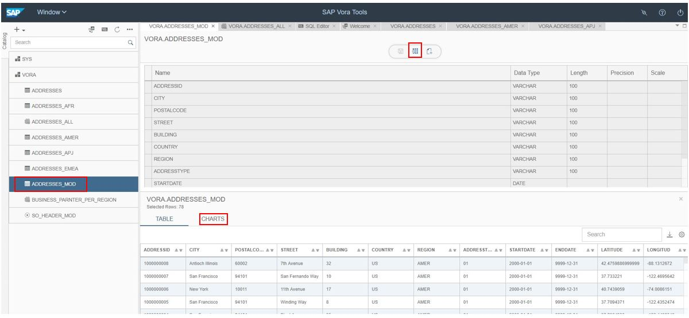
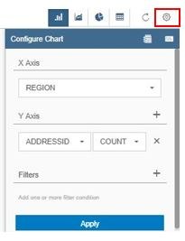
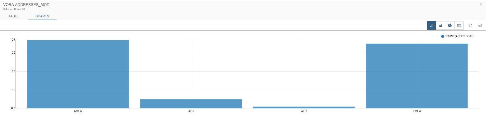
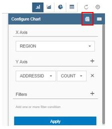
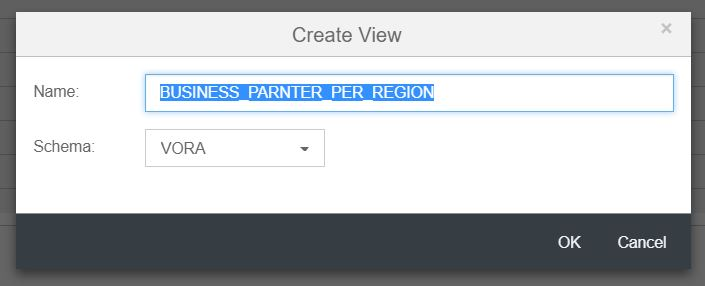
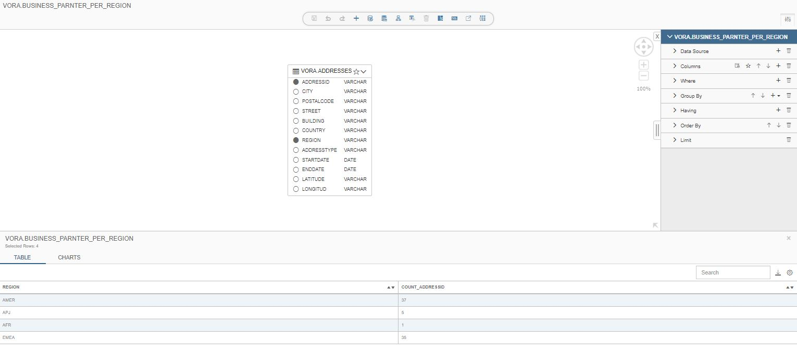

### Visualizing the table

1. select "ADDRESSES_MOD" -> click on preview -> At the bottom select “CHARTS”.

   

2. Click on 'Configure Chart' and make the changes as shown below and select APPLY.

   
   
3. Visualization of data by selecting charts histogram.

   
   
### Creating View from chart

1. Expand the 'Configure Chart'.

   

2. Select 'Create View' pane on 'Configure chart' pane.

   

3. Create View pop will appear. Give the name as 'BUSINESS_PARNTER_PER_REGION'.

   

4. It will create the view from the chart. Click on 'Data Preview' to see the data.

   
