## Currency Conversion

### Create the necessary TCUR tables

1. Go to SQL Editor and create TCUR tables using commands given below. Click on “execute all”.

   ```sql
   CREATE TEMPORARY TABLE TCURX (CURRKEY VARCHAR(5), CURRDEC INTEGER) USING com.sap.spark.engines.relational OPTIONS (files "/user/vora/TCURX.csv", csvdelimiter ",");

   CREATE TEMPORARY TABLE TCURV (MANDT VARCHAR(3), KURST VARCHAR(4), XINVR VARCHAR(1), BWAER VARCHAR(5) , XBWRL VARCHAR(1) , GKUZU VARCHAR(4) , BKUZU VARCHAR(4), XFIXD VARCHAR(1), XEURO VARCHAR(1)) USING com.sap.spark.engines.relational OPTIONS (files "/user/vora/TCURV.csv", csvdelimiter ",");

   CREATE TEMPORARY TABLE TCURN (MANDT VARCHAR(3), FCURR VARCHAR(5), TCURR VARCHAR(5), GDATU VARCHAR(8), NOTATION VARCHAR(1)) USING com.sap.spark.engines.relational OPTIONS (files "/user/vora/TCURN.csv", csvdelimiter ",");

   CREATE TEMPORARY TABLE TCURF (MANDT VARCHAR(3), KURST VARCHAR(4), FCURR VARCHAR(5), TCURR VARCHAR(5), GDATU VARCHAR(8), FFACT INTEGER, TFACT INTEGER, ABWCT VARCHAR(4), ABWGA VARCHAR(8)) USING com.sap.spark.engines.relational OPTIONS (files "/user/vora/TCURF.csv", csvdelimiter ",");

   CREATE TEMPORARY TABLE TCURR (MANDT VARCHAR(3), KURST VARCHAR(4), FCURR VARCHAR(5), TCURR VARCHAR(5), GDATU VARCHAR(8), UKURS DOUBLE, FFACT INTEGER, TFACT INTEGER) USING com.sap.spark.engines.relational OPTIONS (files "/user/vora/TCURR.csv", csvdelimiter ",");

   ```

   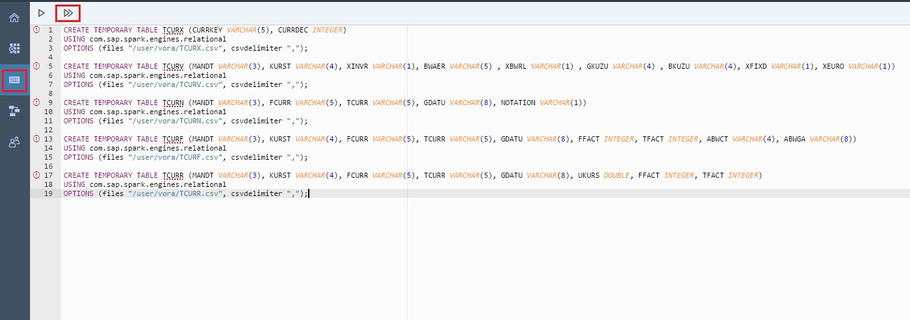

### Creating the View

1. Go to SQL Editor and create the tables “BUSINESS_PARTNER_MOD” & “SO_HEADER_MOD” using commands given below. Click on “execute all”.

   ```sql
   CREATE TABLE BUSINESS_PARTNER_MOD (PARTNERID string, PARTNERROLE string, EMAILADDRESS string, PHONENUMBER string, FAXNUMBER string, WEBADDRESS string, ADDRESSID string, COMPANYNAME string, LEGALFORM string, CREATEDBY_EMPLOYEEID string, CREATEDAT date, CHANGEDBY_EMPLOYEEID string, CHANGEDAT date, CURRENCY string) USING com.sap.spark.engines.relational OPTIONS (tableName "BUSINESS_PARTNER", files "/user/vora/businessPartner.orc", format "orc");
   
   CREATE TABLE SO_HEADER_MOD (SALESORDERID string, CREATEDBY_EMPLOYEEID string, CREATEDAT date, CHANGEDBY_EMPLOYEEID string, CHANGEDAT date, NOTEID string, PARTNERID string, CURRENCY string, GROSSAMOUNT decimal(15,2), NETAMOUNT decimal(15,2), TAXAMOUNT decimal(15,2), LIFECYCLESTATUS string, BILLINGSTATUS string, DELIVERYSTATUS string) USING com.sap.spark.engines.relational OPTIONS (tableName "SO_HEADER", files "/user/vora/soHeaderData.csv");
   
   ```

   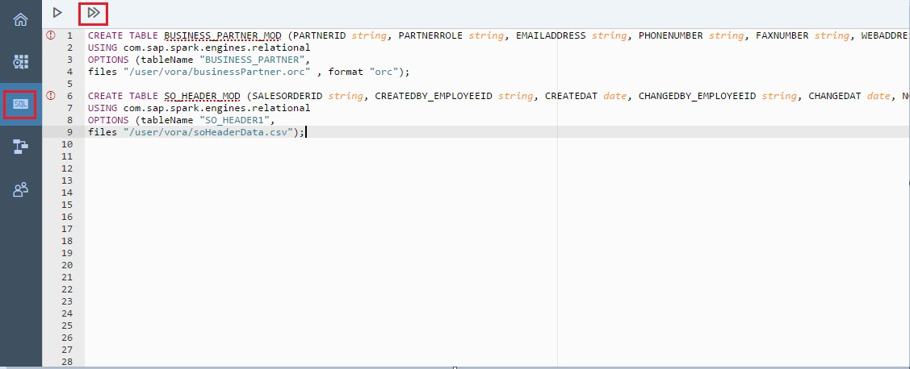
   
2. Click on the “+” button on the left navigation tree, and select Create View option.

   
   
3. Enter the view name as “TOP_CUSTOMERS_MOD” and the Type as “SQL” in the “Create View” dialog as shown below.

   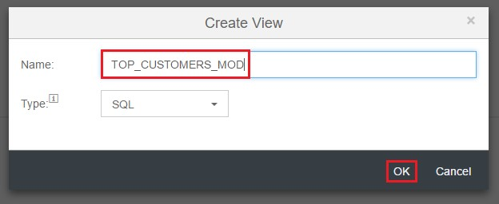
   
4. After creating the view, add BUSINESS_PARTNER_MOD & SO_HEADER_MOD tables using the Add (+) option in the toolbar or drag and drop table from the left panel.
   
   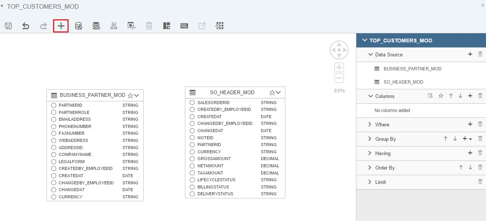
   
5. Create a join between the 2 tables, select the context pad join icon upon selecting “BUSINESS_PARTNER_MOD” and drag and drop the icon to “SO_HEADER_MOD” as shown below.

   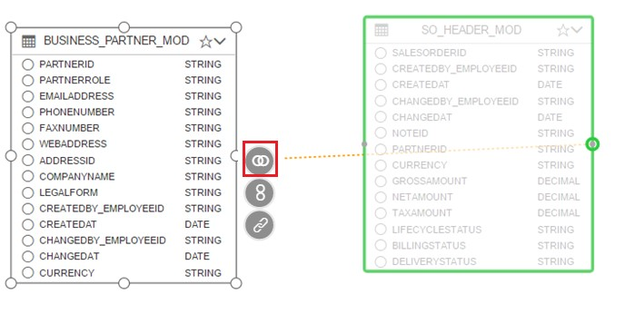
   
6. In the join dialog, choose join type as INNER and join condition as “BUSINESS_PARTNER_MOD.PARTNERID= SO_HEADER_MOD.PARTNERID” as shown below.

   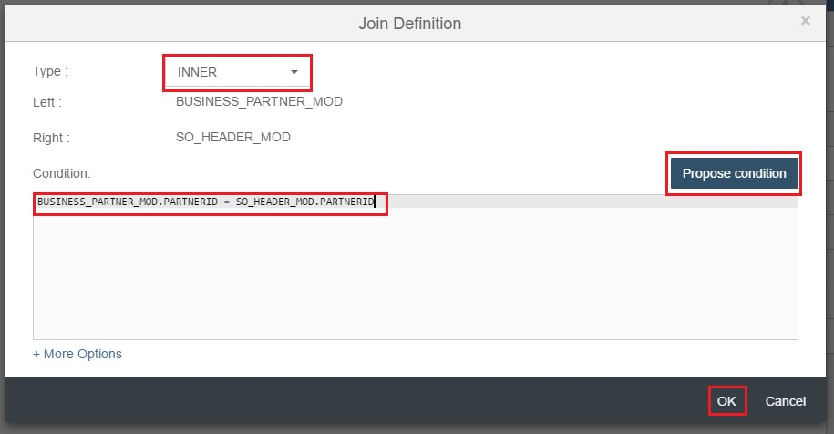
   
7. Add the required columns to output by clicking on the columns name as shown below.
   
   
   
8. In the right panel, under the columns tab, right click on GROSSAMOUNT and select “EDIT” option as shown below.

   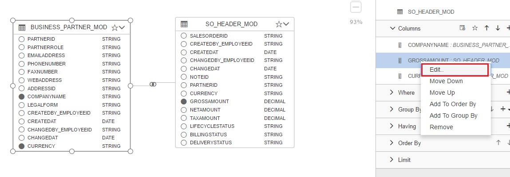
   
9. Enter the Column name “TOTAL_SALES_IN_EUR” and Aggregate function “SUM” as shown below.

   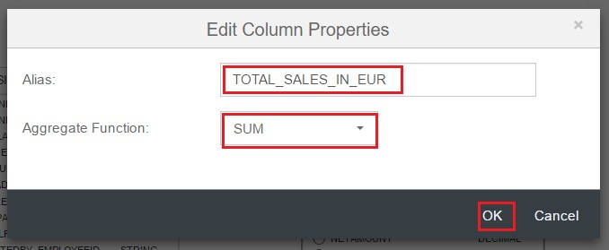
   
10. Right click on “TOTAL_SALES_IN_EUR(GROSSAMOUNT)” and select Add To Order By.
    
    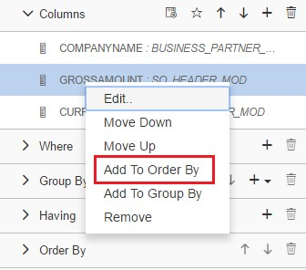
    
11. Now under the Order By tab, double click on “TOTAL_SALES_IN_EUR” and select the sort Direction  “Descending” as shown below.
    
    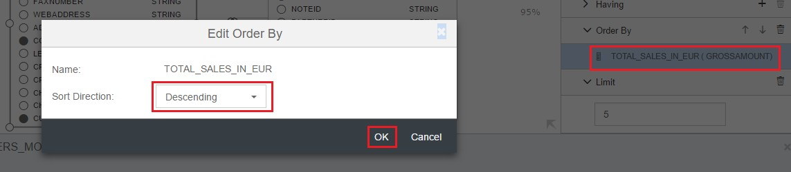
    
12. Add Columns “COMPANYNAME” & “CURRENCY” to group by as shown below.
    
    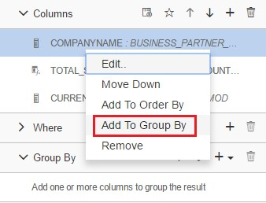
    
13. Enter the value 5 in the Limit tab so that only first 5 records are displayed.
    
    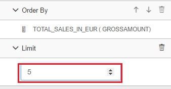
    
14.	Save the created view and preview the data as shown below.

    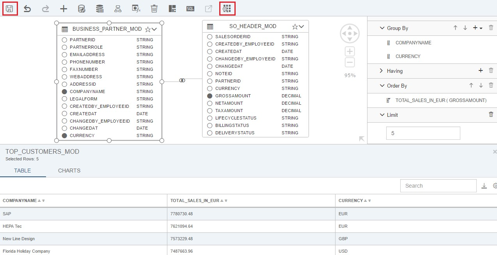

### Currency Conversion for ERP

1. Click on the “+” button on the left navigation tree, and select Create View option as shown below.

   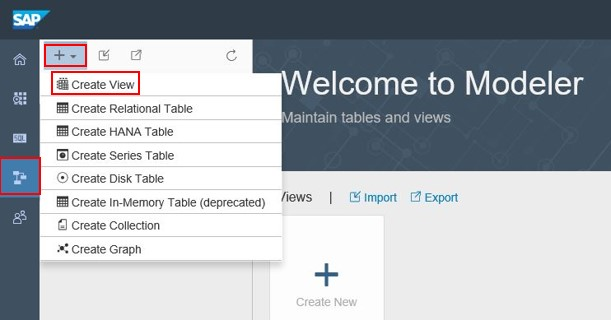
   
2. Enter the view name as “VIEW_CC_ERP” and the Type as “SQL” in the “Create View” dialog as shown below.

   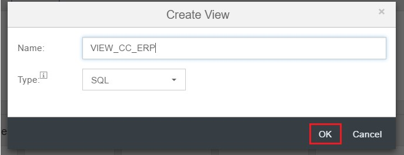
   
3. After creating the view, add “TOP_CUSTOMERS_MOD” using the Add (+) option in the toolbar or drag and drop table from the left panel.

   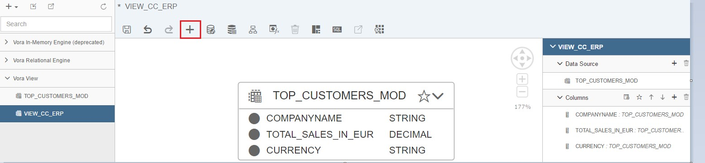
   
4. Create a calculated column by clicking on (+) option in the right panel. Enter name as “TOTAL_SALES_IN_LOCAL_CURR” and click More Options button to see columns operators and functions. Expand Currency Conversion functions and click convert_currency to perform ERP currency conversion. Enter expression as shown below and click OK.

   ```sql
   CONVERT_CURRENCY('000', 'M', TOTAL_SALES_IN_EUR, 'EUR', CURRENCY, CAST(NOW() as DATE))
   ```

   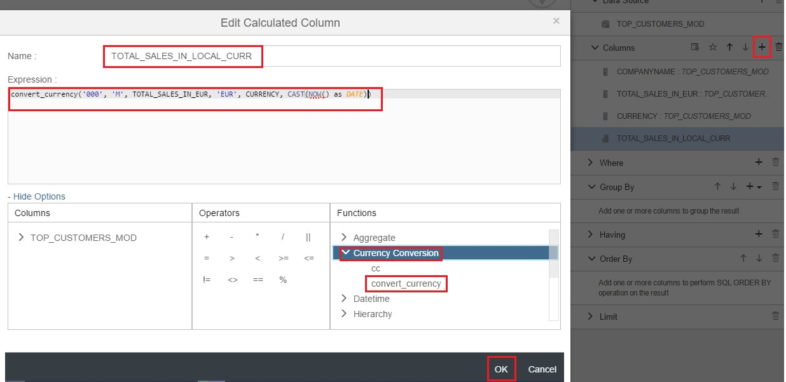
   
5. Select all the columns and then save the created view. Click on preview to see the result.

   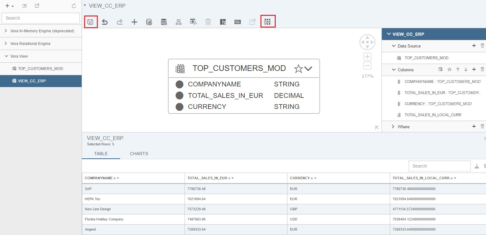
