## Document Store in SAP Vora

### Creating Partition Scheme

1. Open Sql Editor by clicking SQL Editor tab.
2. Write queries mentioned below in SQL editor and click on “Execute All”.

   ```sql   
       CREATE PARTITION FUNCTION DOC_STORE_PF(X) AS HASH(X) MIN PARTITIONS 3 MAX PARTITIONS 3 USING com.sap.spark.engines;

       CREATE PARTITION SCHEME DOC_STORE_PS USING DOC_STORE_PF USING com.sap.spark.engines;
   ```
   
   
   
### Creating Collection

1. Go back to the modeler by clicking modeler tab.
2. Click on + in the navigation pane.
3. Click on “Create Collection”.

   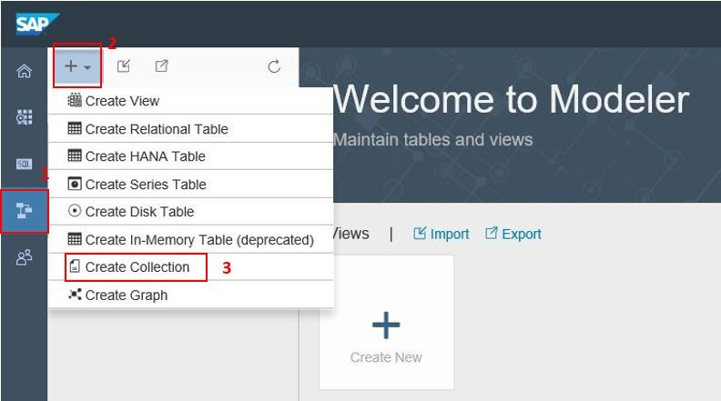

4. Name the collection as “PRODUCT_REVIEWS”. Data source type and engine remains as it is. Enter Partition Scheme as “DOC_STORE_PS” which we have created in step 1.2. Give partition parameter as “rating”. Choose file path in HDFS (here we are using reviews.json file for creating collection) . Check enable file preview.

   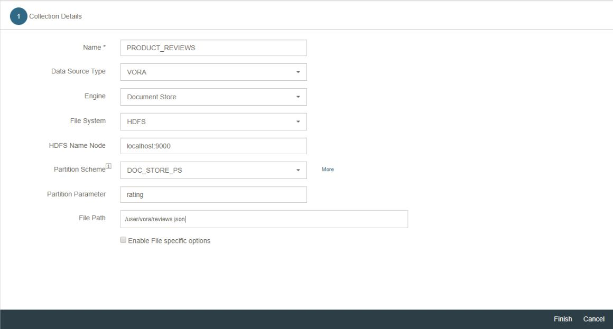

5. Click finish. It will create PRODUCT_REVIEWS collection. It will derive the schema from the first record.
6. Click on preview tab to see the data in collection.

   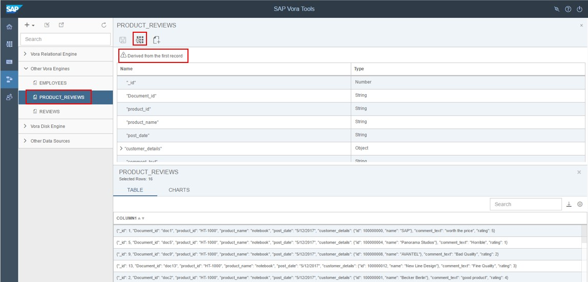

### Creating Views

1. For creating views, again go to the modeler.
2. Click on + in the navigation pane. 
3. Select “Create View” option.
   
   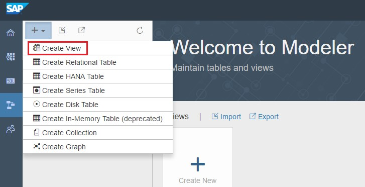

4. Name it as SAMPLE_VIEW. The view type will remain SQL. Click Ok

   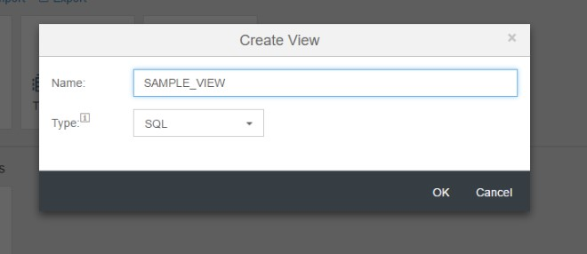
   
5. Now in the SAMPLE_VIEW, add PRODUCT_REVIEWS as data source and place it in the canvas.

   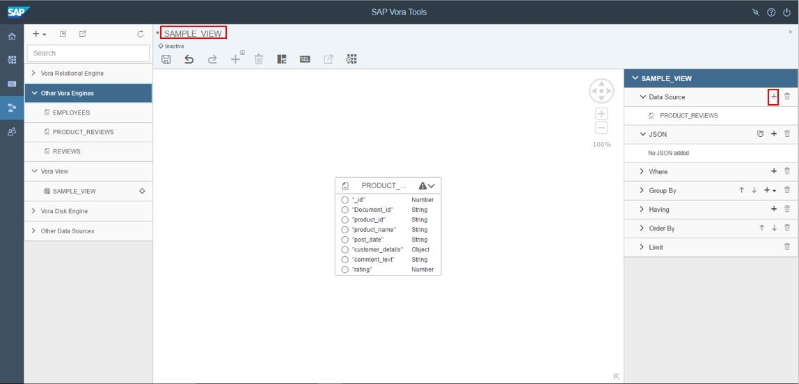
   
6.	Click on “switch to column” in right hand side pane 
7.	Select columns to display by selecting circles next to the column name. Once the column is selected, circle become black. As well as column name are added to columns part of the view in the right pane.
8. Click on preview to see result in column format.

   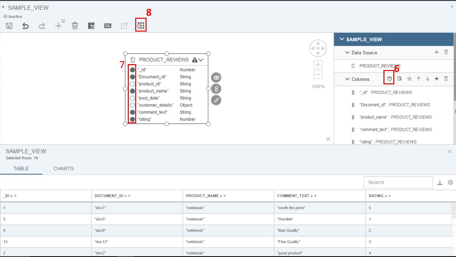
   
9.	We can also see data in json format by adding expression. For that again click on “switch to json” in the JSON part of view. A JSON Definition window will pop up where we have to enter the json expression.
   
    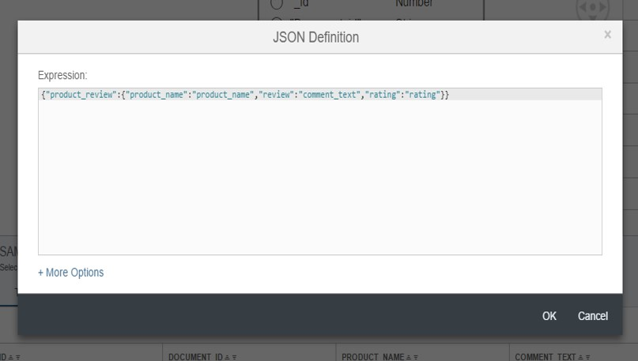
   
10. Add the below expression in the space provided. Click Ok.

     ```json
       {"product_review":{"product_name":"product_name","review":"comment_text","rating":"rating"}}
     ```
11. You can see the expression added under JSON part of view. Click on preview to see the result.

     

### Join between collection and relational table

1.	Create in-memory BUSINESS_PARTNER_MOD TABLE using below query in SQL Editor if it is not exist.

    ```sql
       CREATE TABLE BUSINESS_PARTNER_MOD (PARTNERID string, PARTNERROLE string, EMAILADDRESS string, PHONENUMBER string, FAXNUMBER string, WEBADDRESS string, ADDRESSID string, COMPANYNAME string, LEGALFORM string, CREATEDBY_EMPLOYEEID string, CREATEDAT date, CHANGEDBY_EMPLOYEEID string, CHANGEDAT date, CURRENCY string)
       USING com.sap.spark.engines.relational
       OPTIONS (tableName "BUSINESS_PARTNER",
       files "/user/vora/businessPartner.orc",
       format "orc")
    ```
   
2. Go to the modeler tab. Create view and name it as “SAMPLE_VIEW_2”

   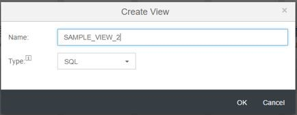
3. Drop  “ SubSelect” from the toolbar action to the editor area. Enter the alias as “SS”. Click OK.

   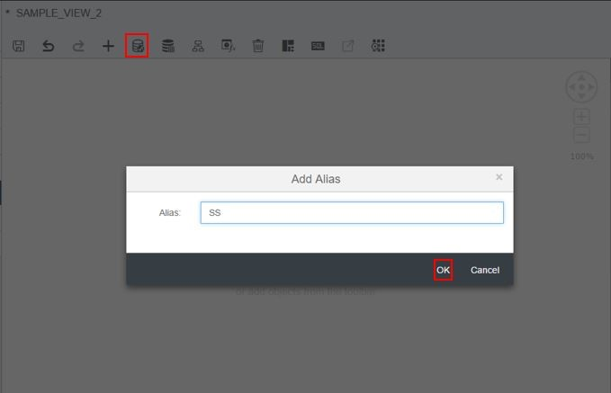
   
4. Inside SS, add collection “PRODUCT_REVIEWS”  in the data source using the “Add(+)” option on the toolbar or drag and drop it from the left panel.

   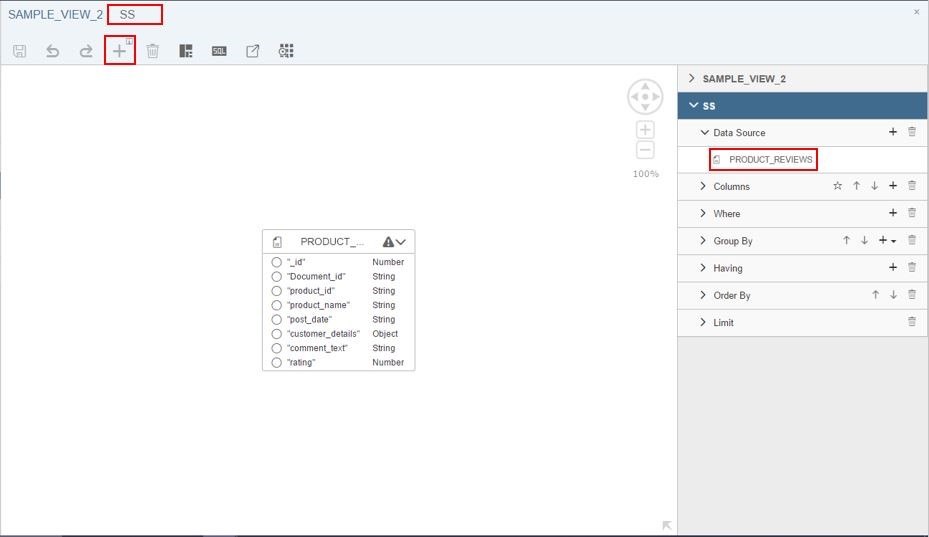
   
5. Add the calculated column by clicking the “+” icon at the “columns” section of SubSelect on the right pane.
6. Enter a name “PARTNERID” and enter “customer_details”.”id” as Expression. Then click OK.

   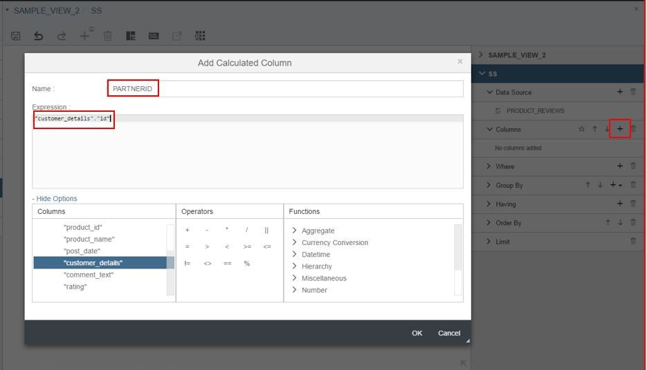
   
7. Use the breadcrumb option to navigate back to the “sample_view_2” and drop BUSINESS_PARNTER_MOD in the editor by clicking the “+” icon or drag and drop it from left pane.

   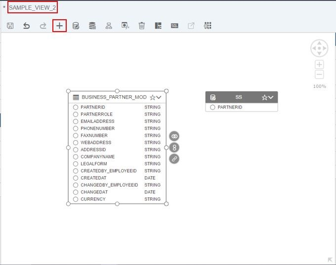
   
8. Create inner join between BUSINESS_PARTNER_MOD and SS by accepting the proposed condition.
9. Select the column PARTNERID from SS and COMPANYNAME, EMAILADDRESS. and PHONENUMBER from BUSINESS_PARTNER_MOD Table.

   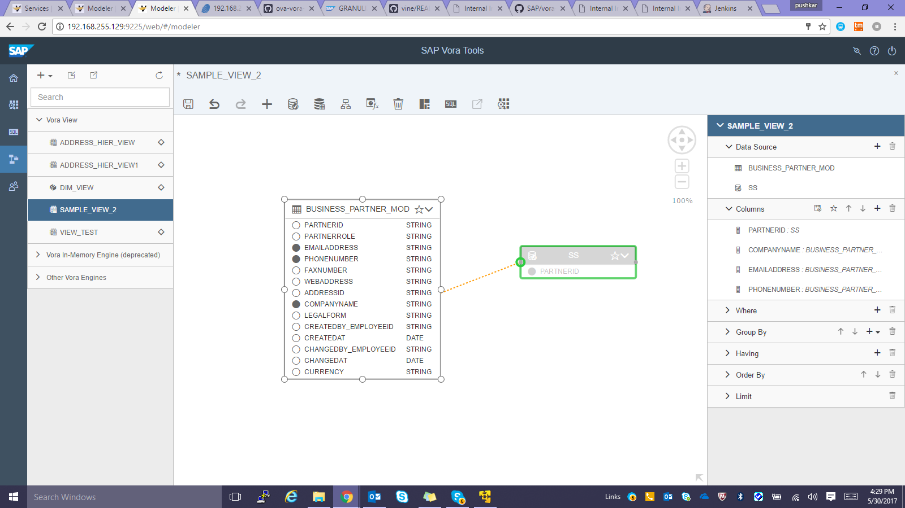
   
   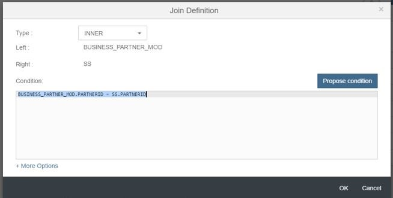
   
10. Click on “save” from the toolbar option to save the view and click on “preview” to preview the result.

    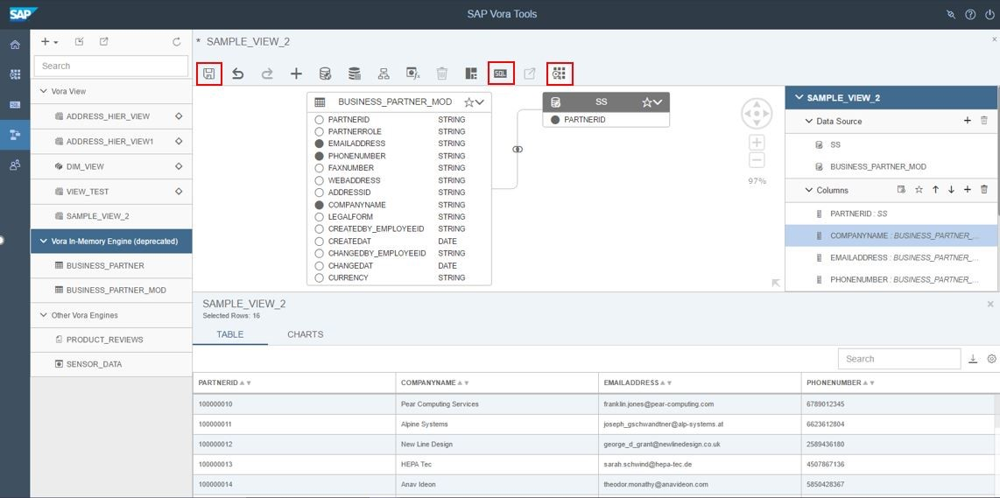
   
11. Click on “SQL” in toolbar action to see the generated sql statement for this view.

    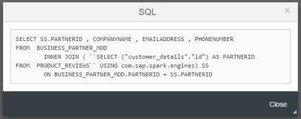
