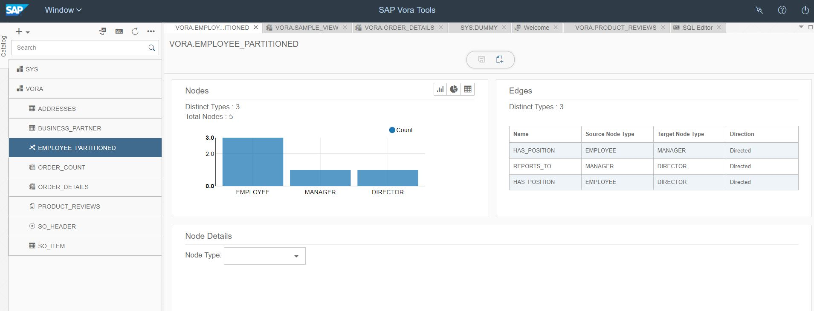
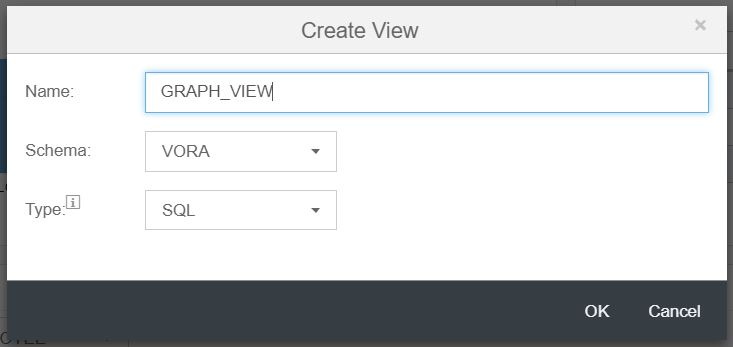

## Graph Engine in SAP Vora

### Create a Graph

1. Go to SQL Editor and create partition function and partition scheme using below commands. Click on “execute all”.

   ```sql
       CREATE PARTITION FUNCTION PFG_EMP_MOD(X BIGINT) AS BLOCK(X) PARTITIONS 16 BLOCKSIZE 1000 USING com.sap.spark.engines;

       CREATE PARTITION SCHEME PSG_EMP_MOD USING PFG_EMP_MOD USING com.sap.spark.engines
   ```
   
   
   
2. Click on the “+” button on the left navigation tree, and select Create GRAPH option. 

   
 
3. Enter the graph name as “EMPLOYEE_PARTITIONED”. Add “EMPLOYEES_GRAPH.jsg” file (/user/vora/EMPLOYEES_GRAPH.jsg). Click finish to create graph.

   
 
   
### Visualize Graph

1. Open Data Browser tab and select “EMPLOYEE_PARTITIONED” graph. It will open the summary page for the graph with edge and node summary.

   
 
2. Select “EMPLOYEE” node type in the drop down for Node Details panel. The list of employees will be displayed in table.

   
 
3. Click on the “visualize” button on the right-hand side. It will load the graphical representation of the graph.

   
 
4. Select a node. The details of node will be displayed in the right-hand side pane.

   
 
5. Click on config tab and Check “show node ID” check box. Click on apply. Node ID of each node will be displayed in the graph view.

   
 
6. Switch back to GENERAL tab. Search node with node id 4 using search box. The corresponding node will be highlighted and node details will be loaded in the selection section on right pane.

   
 
### Create a view with Graph

1. Go to the modeler and  Click on ‘+’ button in the navigation bar and select ‘create view’ option.
2. Enter Name as ‘GRAPH_VIEW’. Type will remain same. Click OK

   
 
3. Drag and drop the ‘EMPLOYEE_PARTITIONED’ graph from the left side pane. It will show the metadata viewer. 
4. Here you can see node, edges and their relationship.

   
