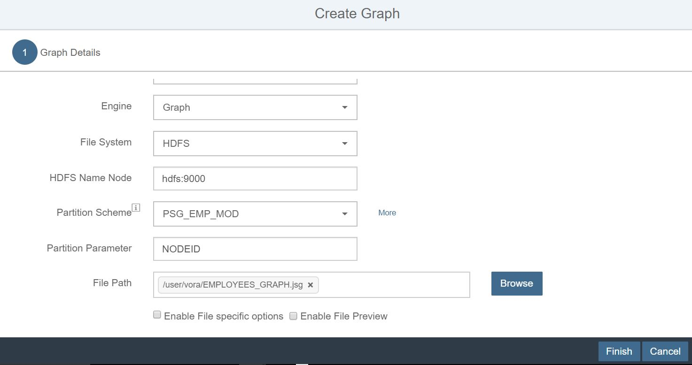
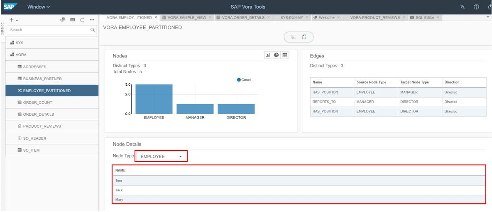
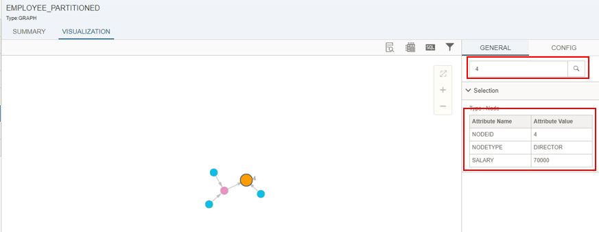
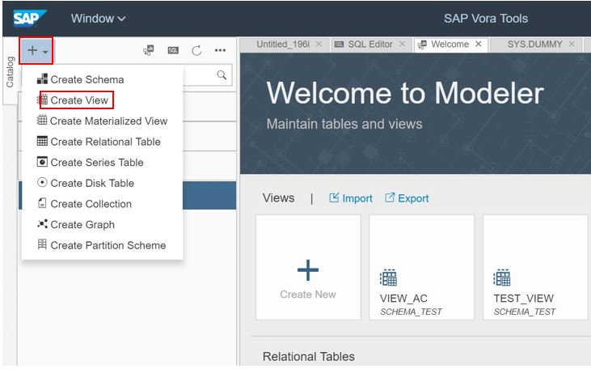

## Graph Engine in SAP Vora

### Create a Graph

1. Open the vora tools.

2. Select the '+' button on the left and select 'Create Partition Scheme'.

   
   
3. Name the partition scheme as 'PSG_EMP_MOD' and provide the settings as below.

   
   
4. Click on 'ADD' button and then 'CLOSE'. 
 
5. Enter the graph name as “EMPLOYEE_PARTITIONED”. Add “EMPLOYEES_GRAPH.jsg” file (/user/vora/EMPLOYEES_GRAPH.jsg). Click finish to create graph.

   

6. Once graph is created, It will open the summary page for the graph with edge and node summary.

   
 
7. Select “EMPLOYEE” node type in the drop down for Node Details panel. The list of employees will be displayed in table.

   
   
8. For visualizing the graph, right click on the "EMPLOYEE_PARTITIONED" graph and select 'Data Preview'.

   
   
9. It will open the summary page of the graph. Switch to 'VISUALIZATION' tab. It will load the graphical representation of the graph.

   
   
10. Select a node. The details of node will be displayed in the right-hand side pane.

   
   
11. Click on config tab and Check “show node ID” check box. Click on apply. Node ID of each node will be displayed in the graph view.

   
   
12. Switch back to GENERAL tab. Search node with node id 4 using search box. The corresponding node will be highlighted and node details will be loaded in the selection section on right pane.

   
 
### Create a view with Graph

1. Go to the modeler and  Click on ‘+’ button in the navigation bar and select ‘create view’ option.

   
   
2. Enter Name as ‘GRAPH_VIEW’. Type will remain same. Click OK

   
 
3. Drag and drop the ‘EMPLOYEE_PARTITIONED’ graph from the left side pane. It will show the metadata viewer. 
4. Here you can see node, edges and their relationship.

   
