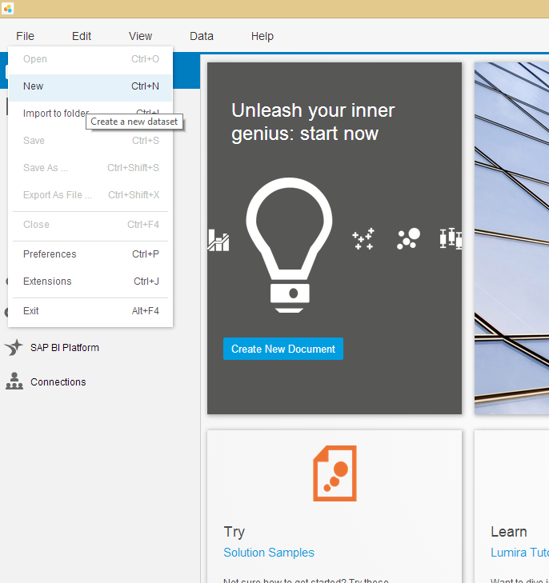
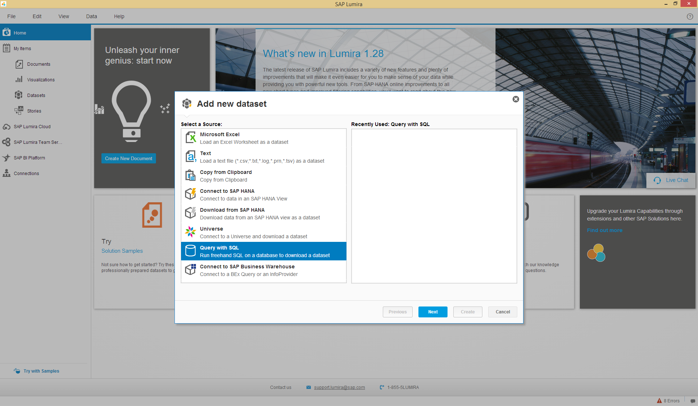
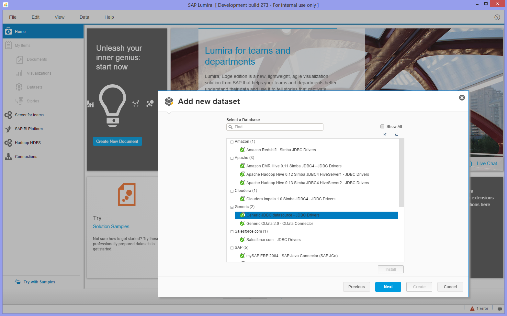
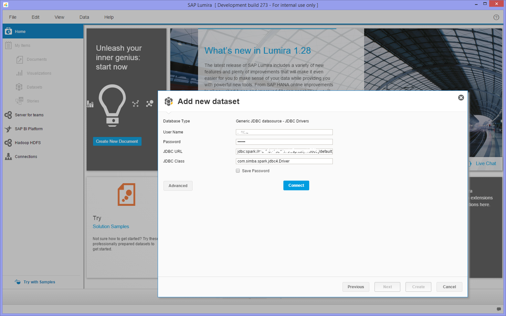
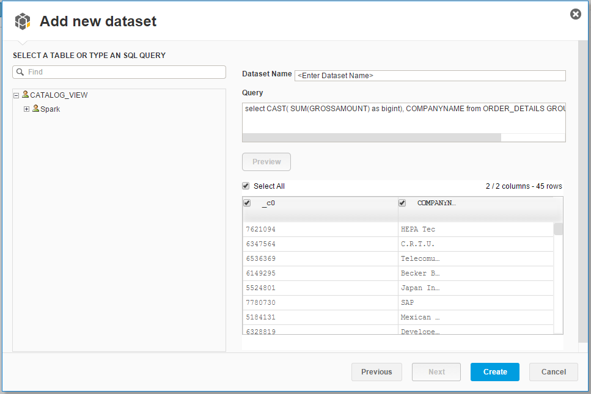
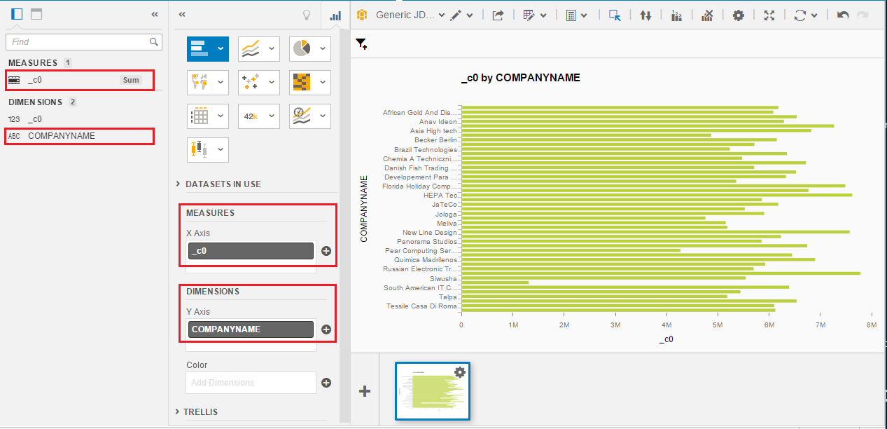

SAP Lumira Visualization
===============

## Connection setup in SAP Lumira
1.  Install JDBC driver
We will need to use the Apache Spark drivers as Generic JDBC driver. In SAP Lumira
    - Go to File -> Preferences -> SQL Drivers -> Generic -> Generic JDBC datasource, click on "Install Drivers" at the upper right
    - Select all *.jar files under (SAP Lumira Installation Folder)\Desktop\utilities\SparkJDBC
    - Restart SAP Lumira

## Visualizing in SAP Lumira

1. Open up SAP Lumira Desktop on your machine, and select File -> New.

2. Select "Query with SQL", and click Next.

3. Choose the Generic JDBC Data source (green mark indicates drivers are installed)

4. Enter the credentials and connection URLs as below and press connect:
    - Enter Username and password
    - JDBC URL: jdbc:spark://[host]:[Vora Thrift Server's Port]/default;CatalogSchemaSwitch=0;UseNativeQuery=1 (Default Port : 10000)
    > If you are using SAP Data Hub Developer Edition , expose the Vora Thrift Server's port also while running the Container. 
    
    - JDBC Class: com.simba.spark.jdbc4.Driver

5. In the Query box type the query
`select CAST( SUM(GROSSAMOUNT) as bigint), COMPANYNAME from ORDER_DETAILS GROUP BY COMPANYNAME`
6. Press Preview button to preview results of query

7. Click on Create Button
8.  Drag the Sum column to X Axis and Company Name to Y Axis in Visualization Tab of Lumira as shown in snapshot

 
