## Star Schema in SAP Vora

1. Go to SQL Editor and create the below table which will be required to complete this scenario.

   ```sql
   
   CREATE TABLE PRODUCTS_MOD (PRODUCTID string, TYPECODE string, CATEGORY string, CREATEDBY_EMPLOYEEID string, CREATEDAT date, CHANGEDBY_EMPLOYEEID string, CHANGEDAT date, NAMEID string, DESCID string, PARTNERID string, TAXTARIFFCODE integer, QUANTITYUNIT string, WEIGHTMEASURE decimal(13,3), WEIGHTUNIT string, CURRENCY string, PRICE decimal(15,2), PRODUCTPICURL string, WIDTH decimal(13,3), DEPTH decimal(13,3), HEIGHT decimal(13,3), DIMENSIONUNIT string) USING com.sap.spark.engines.relational OPTIONS (tableName "PRODUCTS",files "/user/vora/products.csv");

   CREATE TABLE BUSINESS_PARTNER_MOD (PARTNERID string, PARTNERROLE string, EMAILADDRESS string, PHONENUMBER string, FAXNUMBER string, WEBADDRESS string, ADDRESSID string, COMPANYNAME string, LEGALFORM string, CREATEDBY_EMPLOYEEID string, CREATEDAT date, CHANGEDBY_EMPLOYEEID string, CHANGEDAT date, CURRENCY string) USING com.sap.spark.engines.relational OPTIONS (tableName "BUSINESS_PARTNER", files "/user/vora/businessPartner.orc" , format "orc");

   CREATE TABLE SO_HEADER_MOD (SALESORDERID string, CREATEDBY_EMPLOYEEID string, CREATEDAT date, CHANGEDBY_EMPLOYEEID string, CHANGEDAT date, NOTEID string, PARTNERID string, CURRENCY string, GROSSAMOUNT decimal(15,2), NETAMOUNT decimal(15,2), TAXAMOUNT decimal(15,2), LIFECYCLESTATUS string, BILLINGSTATUS string, DELIVERYSTATUS string) USING com.sap.spark.engines.relational OPTIONS (tableName "SO_HEADER1", files "/user/vora/soHeaderData.csv");

   CREATE TABLE SO_ITEM_MOD (SALESORDERID string, SALESORDERITEM string, PRODUCTID string, NOTEID string,  CURRENCY string, GROSSAMOUNT decimal(15,2), NETAMOUNT decimal(15,2), TAXAMOUNT decimal(15,2), ITEMATPSTATUS string, OPITEMPOS string, QUANTITY decimal(15,2), QUANTITYUNIT string, DELIVERYDATE date  ) USING com.sap.spark.engines.relational OPTIONS (tableName "SO_ITEM", files "/user/vora/soItemData.csv");
   ```

   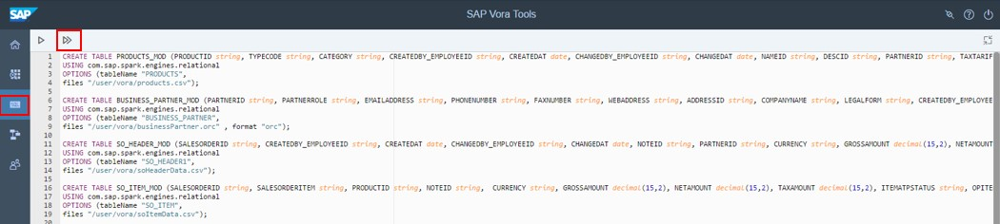
   
2. Go back to the modeler and click on the ‘+’ symbol and select ‘Create View’.

   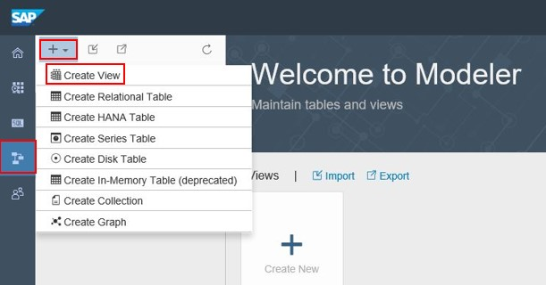
   
3. Name the view as ‘PRODUCTS_DIM’ and select ‘DIMENSION’ as type.
   
   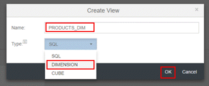
   
4. Add ‘PRODUCTS_MOD’ inside the view. 
5. Click on ‘star’ symbol on the top right corner of the table. It will add all the columns to the right-hand side panel under column section. Click on save button to save the view.

   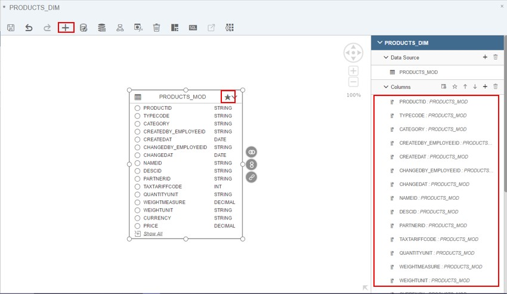
   
6. Similarly create the dimension view ‘BUSINESS_PARTNER_DIM’.

   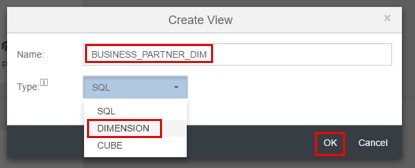
   
7. Add ‘BUSINESS_PARTNER_MOD’ table to the view and all the columns to the output and save the view.

   
   
8. To create a cube, open create view dialog. Enter ‘SALES_ORDER_FACT’ in name field and ‘CUBE’ in type.
   
   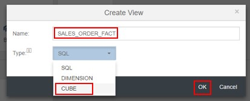
   
9. Click OK. It will open the view editor. By default, one Facts table will be there.
   
   
   
10.	Open Facts by using context menu option or double click. Add ‘SO_HEADER_MOD’ and ‘SO_ITEM_MOD’ tables to this Facts.
11.	Create inner join between these tables based on condition “SO_HEADER_MOD.SALESORDERID = SO_ITEM_MOD.SALESORDERID”
12.	Add SALESORDERID, PARTNERID from SO_HEADER_MOD and SALESORDERITEM, PRODUCTID and QUANTITY to the output column.

    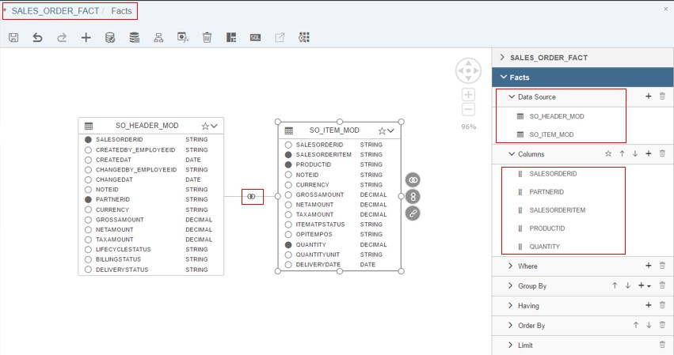
   
    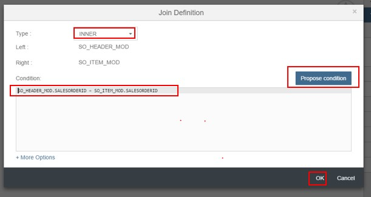
   
13.	Go back to the main view. To create the star join add ‘BUSINESS_PARTNER_DIM’ and ‘PRODUCTS_DIM’ to the main view.

    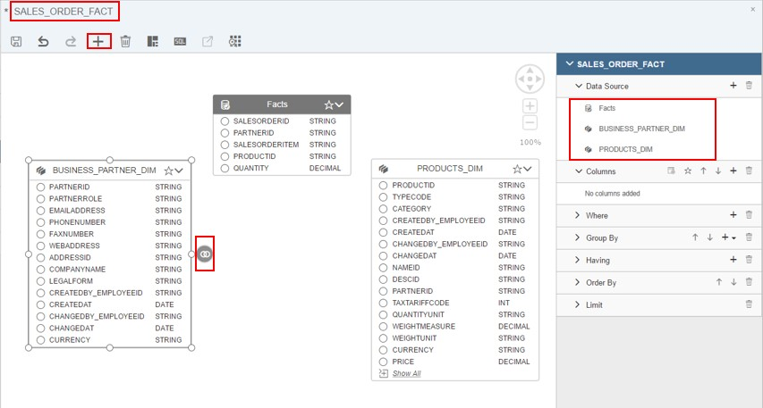
   
14.	Create inner join between Facts and BUSINESS_PARTNER_DIM with the condition “Facts.PARTNERID = BUSINESS_PARTNER_DIM.PARTNERID”.

    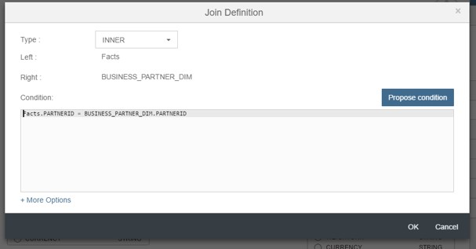
   
15. Create inner join between Facts and PRODUCTS_DIM with the condition “Facts.PRODUCTID = PRODUCTS_DIM.PRODUCTID".

    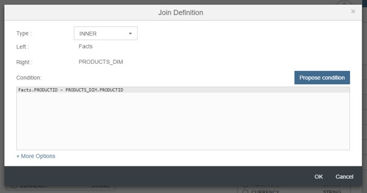
   
16. Add PARTNERID, PHONENUMBER and COMPANYNAME from ‘BUSINESS_PARTNER_DIM’ , SALESORDERID and SALESORDERITEM from ‘FACTS’ and PRODUCTID, CATEGORY, PRICE from ‘PRODUCTS_DIM’ to output.

    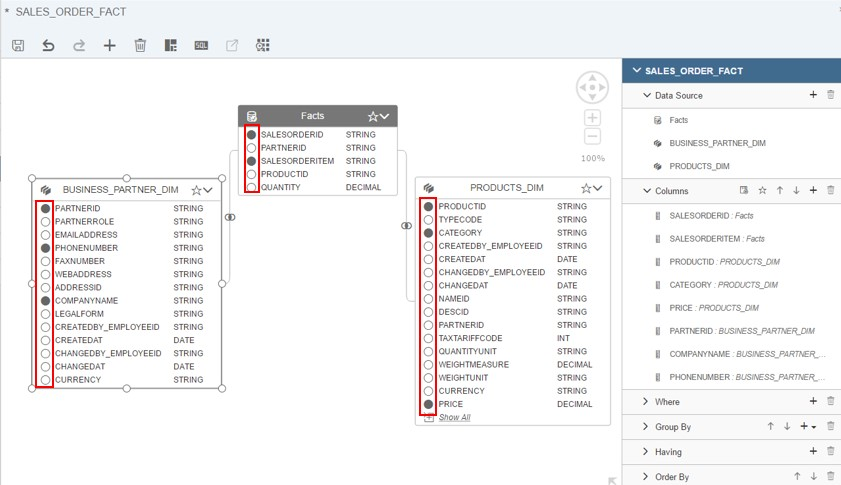
   
17. Save the view and see data preview by clicking on ‘Data preview’ tab.

    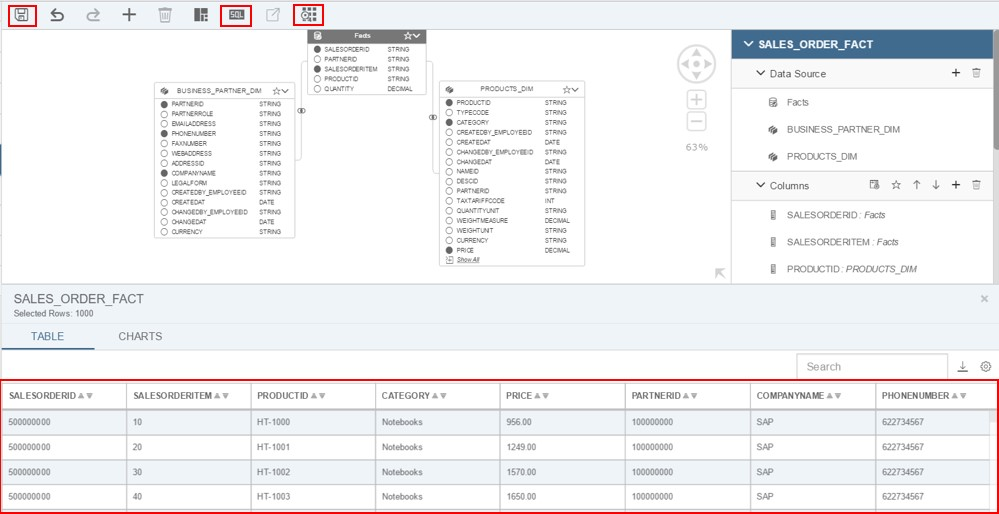
