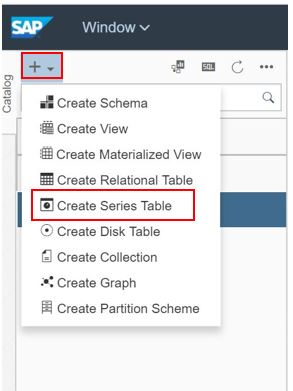
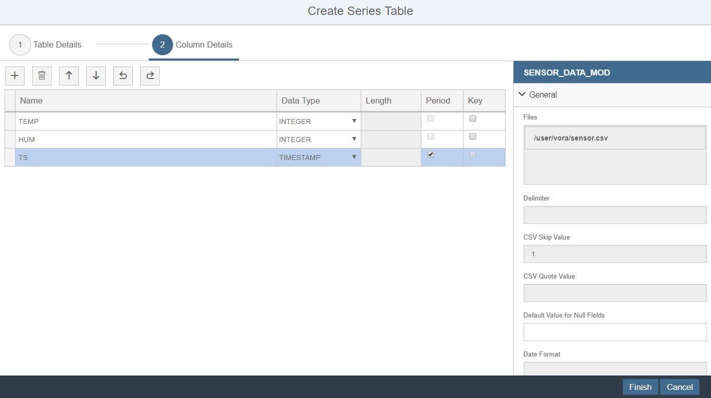
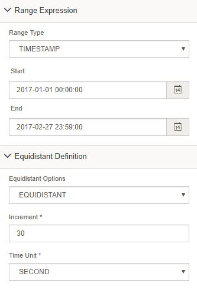

## Time Series in SAP Vora

### Create Series table 

1. Open the vora tools.

2. Select the '+' button on the left and select 'Create Partition Scheme'.

   
   
3. Name the partition scheme as 'PS_TS' and provide the settings as below.

   
   
4. Click on 'ADD' button and then 'CLOSE'. 

5. Again click on ‘+’ button and select ‘Create Series Table’.

   

3. Enter name ‘SENSOR_DATA_MOD’ and Engine would remain same as Time Series. Choose File System as HDFS and file path as ‘/user/vora/sensor.csv’ and CSV Skip value would be 1.

   

4. Click next to navigate to column details.
5. In column details, Edit the column names and give the name as TEMP, HUM, and TS.
6. Column with timestamp or date as data type can be selected as period column. Check period check box against TS column.

   

7. In the right panel we can add additional property for series table. Add partition scheme 'PS_TS' by clicking the '+' sign and give partition parameter as 'TS'.

   
   
   

8. Specify the range expression as given below.

   
   
9. Click on Finish.

   

### Create a view with Auto Correlation

1. Click on ‘+’ button in the left navigation tree, and select ‘Create View’ option.
2. Enter the view name as ‘VIEW_AC’. Type will remain sql. Click OK

   

3. After creating view , add time series table function from the tool bar. Enter name as ‘TableFunction_AC’ 
4. Select Type ‘Auto Correlation’ and click on OK

   

5. Add ‘SENDOR_DATA_MOD’ table using the ‘+’ option in the toolbar or drag and drop table from the left side panel.
6. Select ‘Temp’ as Descriptor and add 10 for Max Time Lag in the right-side pane.

   

7. Go back to the main view using breadcrumb. Add all columns to the output.
8. Click on save to save the view and click on data preview to see the data preview.

   

### Data Visualization for Time Series Engine

1. Click on ‘SENSOR_DATA_MOD’ to visualize ans select the 'CHART' tab.

   

2. Select 'Granulize'

   
   
3. Configure the below properties of chart.

   

4. Click on ‘Apply’ to generate graph for time series table. Default chart selection would be line chart.

   

5. We see two line chart. The below one is lower resolution chart.  Select a small section of lower chart. It will load higher resolution data on the selected range in the upper line chart.

   

