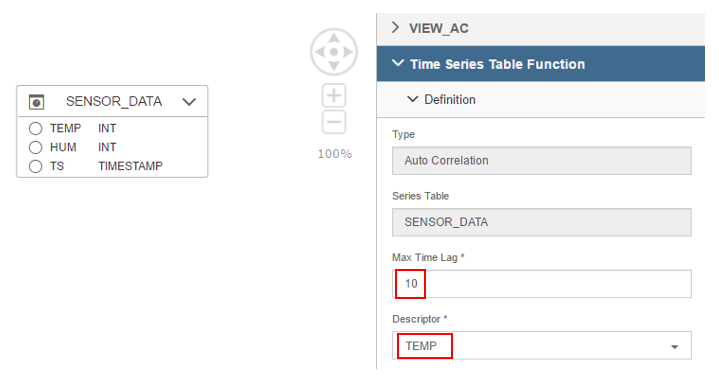

## Time Series in SAP Vora

### Create Series table 

1. Open Sql Editor and create partition function
and partition scheme using the following command. Click on ‘Execute all’.

   ```sql
       CREATE PARTITION FUNCTION PF_TS(TS TIMESTAMP) AS RANGE
       BOUNDARIES(TIMESTAMP '2017-01-20 00:00:00', TIMESTAMP '2017-02-10 00:00:00')
       USING com.sap.spark.engines;         
    
       CREATE PARTITION SCHEME PS_TS USING PF_TS USING com.sap.spark.engines;
    ```
 
 
    
 
2. Go to modeler and click on ‘+’ button and select ‘Create Series Table’.

   

3. Enter name ‘SENSOR_DATA_MOD’ and Data Source Type would and Engine would remain same. Enter file path as ‘/user/vora/sensor.csv’ and CSV Skip value would be 1.

   

4. Click next to navigate to column details.
5. Add columns by clicking on ‘add’ button as show below. Add three column TEMP, HUM, and TS in the table.
6. Column with timestamp or date as data type can be selected as period column. Check period check box against TS column.

   

7. In the right panel we can add additional property for series table. Add partition scheme 'PS_TS' by clicking the '+' sign and give partition parameter as 'TS'.

   
   
   

8. Specify the range expression as given below.

   

### Create a view with Auto Correlation

1. Click on ‘+’ button in the left navigation tree, and select ‘Create View’ option.
2. Enter the view name as ‘VIEW_AC’. Type will remain sql. Click OK

   

3. After creating view , add time series table function from the tool bar. Enter name as ‘TableFunction_AC’ 
4. Select Type ‘Auto Correlation’ and click on OK

   

5. Add ‘SENDOR_DATA_MOD’ table using the ‘+’ option in the toolbar or drag and drop table from the left side panel.
6. Select ‘Temp’ as Descriptor and add 10 for Max Time Lag in the right-side pane.

   

7. Go back to the main view using breadcrumb. Add all columns to the output.
8. Click on save to save the view and click on data preview to see the data preview.

   

### Data Visualization for Time Series Engine

1. Go to Data browser and click on ‘SENSOR_DATA_MOD’ to visualize.

   

2. Click on the chart tab and select 'Granulize'
3. Configure the below properties of chart.

   

4. Click on ‘Apply’ to generate graph for time series table. Default chart selection would be line chart.

   

5. We see two line chart. The below one is lower resolution chart.  Select a small section of lower chart. It will load higher resolution data on the selected range in the upper line chart.

   


