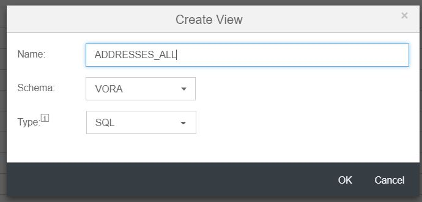

## Unions in VORA Views

SAP Vora tools can be used to create views with unions, allowing you to combine data from two or more data source. To create a view with union in SAP Vora follow the below steps.

1. Open SQL Editor and run the below queries in SQL editor which will create required data sources for union.

```sql
CREATE TABLE ADDRESSES_AFR (ADDRESSID VARCHAR(100), CITY VARCHAR(100), POSTALCODE VARCHAR(100), STREET VARCHAR(100), BUILDING VARCHAR(100), COUNTRY VARCHAR(100), REGION VARCHAR(100), ADDRESSTYPE VARCHAR(100), STARTDATE date, ENDDATE date, LATITUDE VARCHAR(100), LONGITUD VARCHAR(100)) STORE IN MEMORY;
ALTER TABLE ADDRESSES ADD DATASOURCE PARQUET(HDFS('hdfs://hdfs:9000/user/vora/ADDRESSES_AFR.csv'));
Load Table ADDRESSES_AFR;

CREATE TABLE ADDRESSES_APJ (ADDRESSID VARCHAR(100), CITY VARCHAR(100), POSTALCODE VARCHAR(100), STREET VARCHAR(100), BUILDING VARCHAR(100), COUNTRY VARCHAR(100), REGION VARCHAR(100), ADDRESSTYPE VARCHAR(100), STARTDATE date, ENDDATE date, LATITUDE VARCHAR(100), LONGITUD VARCHAR(100)) STORE IN MEMORY;
ALTER TABLE ADDRESSES ADD DATASOURCE PARQUET(HDFS('hdfs://hdfs:9000/user/vora/ADDRESSES_APJ.csv'));
Load Table ADDRESSES_APJ;

CREATE TABLE ADDRESSES_AMER (ADDRESSID VARCHAR(100), CITY VARCHAR(100), POSTALCODE VARCHAR(100), STREET VARCHAR(100), BUILDING VARCHAR(100), COUNTRY VARCHAR(100), REGION VARCHAR(100), ADDRESSTYPE VARCHAR(100), STARTDATE date, ENDDATE date, LATITUDE VARCHAR(100), LONGITUD VARCHAR(100)) STORE IN MEMORY;
ALTER TABLE ADDRESSES ADD DATASOURCE PARQUET(HDFS('hdfs://hdfs:9000/user/vora/ADDRESSES_AMER.csv'));
Load Table ADDRESSES_AMER;

CREATE TABLE ADDRESSES_EMEA (ADDRESSID VARCHAR(100), CITY VARCHAR(100), POSTALCODE VARCHAR(100), STREET VARCHAR(100), BUILDING VARCHAR(100), COUNTRY VARCHAR(100), REGION VARCHAR(100), ADDRESSTYPE VARCHAR(100), STARTDATE date, ENDDATE date, LATITUDE VARCHAR(100), LONGITUD VARCHAR(100)) STORE IN MEMORY;
ALTER TABLE ADDRESSES ADD DATASOURCE PARQUET(HDFS('hdfs://hdfs:9000/user/vora/ADDRESSES_EMEA.csv'));
Load Table ADDRESSES_EMEA;

   ```
   
2. Click the "+" sign at the top left corner of vora tool and select "Create View".

  

3. Name the view as "ADDRESSES_ALL".The view type will remain SQL. Click Ok.

  

4. Add ADDRESSES_AFR, ADDRESSES_APJ, ADDRESSES_AMER and ADDRESSES_EMEA as a data source by draging it from the catolog pane.

  

5. Create the Union between ADDRESSES_AFR and ADDRESSES_APJ table, click and highlight the ADDRESSES_AFR table and click on the Union symbol.

  

6. Drag and drop it to the ADDRESSES_APJ header table.

  

7. Once dropped it will pop up the ResultSets. Add output columns to the ResultSets by clicking the 'star' symbol at the top of the tables.

  

8. Similarly create union between generated ResultSet (NOT Default ResultSet) and the table ADDRESSES_AMER and add columns to the output result set by clicking the 'Star' symbol.

  

9. Similarly create union between ADDRESSES_EMEA and ResultSet and add the columns.

  

10. Save the view and click on 'Data Preview' to see the result.

  
